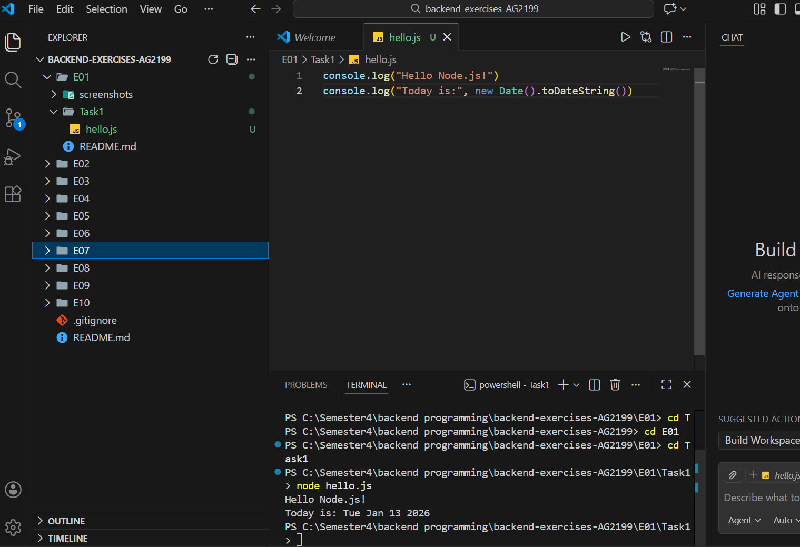
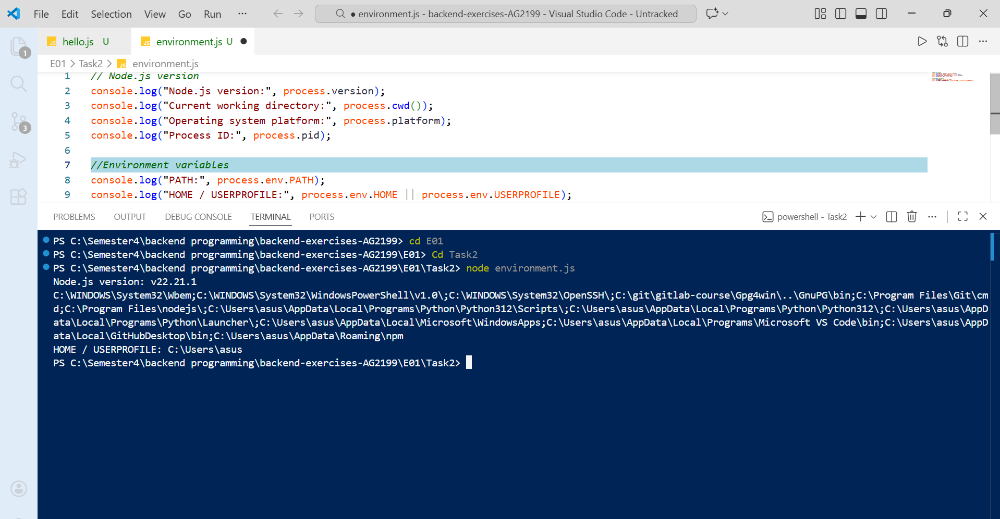
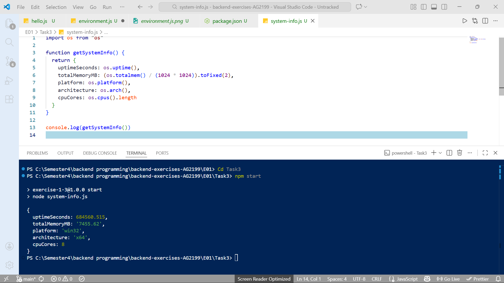
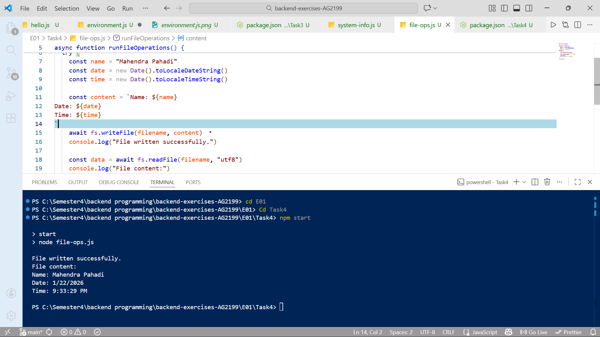
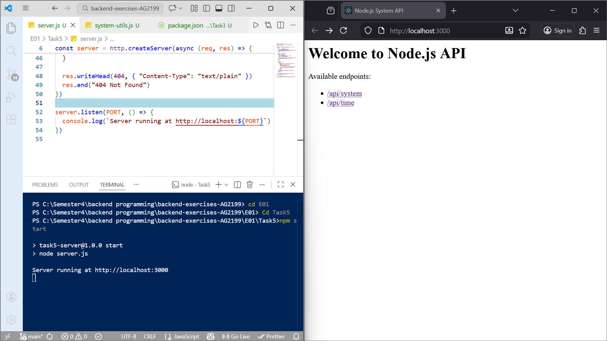
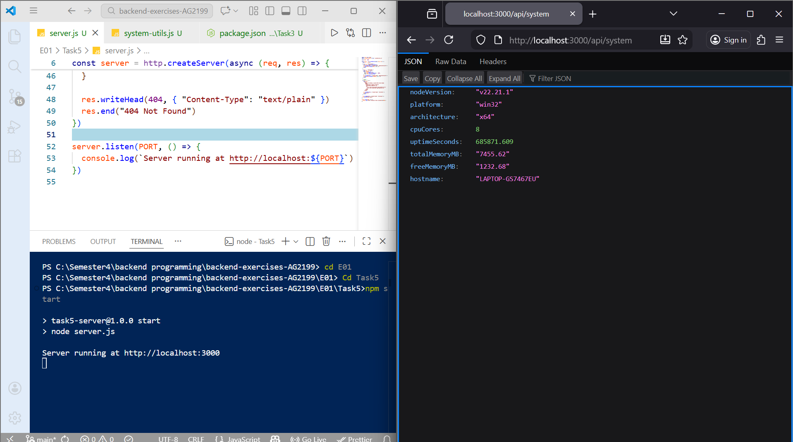
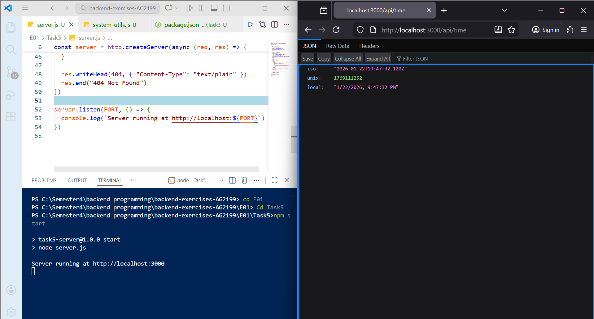

# Exercise set 01

This document explains how I completed **Exercise Set 01**.  
I used **Node.js** and **ES modules** for all tasks.  
Screenshots are included to show that the programs worked correctly.

## Task 1

In Task 1, I installed the **LTS version of Node.js** on my computer.  
I checked that Node.js and npm were working by running these commands in my terminal:

node -v
npm -v 

After that, I created a file called hello.js.
The program prints a welcome message and the current date using JavaScript’s Date object.

I ran the program with: node hello.js


## Task 2 

In Task 2, I created a file called `environment.js`.  
This program shows information about my Node.js environment using the `process` object.

The program prints:

- Node.js version  
- Current working directory  
- Operating system platform  
- Process ID  
- Some environment variables (`PATH` and `HOME` or `USERPROFILE`)

I ran the program with:

```bash
node environment.js
```



## Task 3

In this Task, I created a `package.json` file and enabled ES modules by adding `"type": "module"`.  
I used the built-in `os` module to collect system information, such as:

- System uptime  
- Total memory  
- Platform name  
- CPU architecture  
- Number of CPU cores  

This logic was placed inside a function called `getSystemInfo()`.  
The function returns an object, which is then printed to the console.

Then i started the program using:

```bash
npm start
```


## Task 4 

In this Task, I worked with files using the `fs/promises` module.  
The program creates a new file called `output.txt`. Inside this file, it writes my name, the current date, and the current time.  

After writing the file, the program reads it back and prints its contents to the console.  
All file operations are handled inside a `try/catch` block to make sure that any errors are caught and displayed.  

I ran the program using: 

```bash
npm start
```


## Task 5 – First JSON API with modules

In this Task, I created a small HTTP server using Node.js.  
The server uses the built-in `http` module to handle requests.  
I separated the logic for collecting system information into a file called `system-utils.js`. This file exports a function called `getSystemInfo()`, which the server uses to get system data.

The server has three routes:

1. `/api/system` – This route returns system information in JSON format, including uptime, memory, CPU details, platform, and Node.js version.  
2. `/api/time` – This route returns the current time in ISO format, Unix timestamp, and local time format.  
3. `/` – This route shows a simple HTML page with links to the two API routes, so users can easily navigate.

I tested the server in the browser and confirmed that all endpoints worked correctly.  
The JSON responses are properly formatted and easy to read.

**Screenshots of the output below:**
- web page `/`  


- System info JSON `/api/system`  


- Current time JSON `/api/time` 


## AI Usage

I used AI tools for about 25% of the work.  
The AI helped me to:

- Understand Node.js concepts more clearly  
- Check and interpret error messages  
- Review my code structure and follow good programming practices  

Even though AI assisted me, **all the code was written, executed, and fully understood by me**. I know how each part of the program works.


## Final Notes

This exercise helped me learn many important things in Node.js, including:

- The basics of Node.js and how it works  
- How to use built-in modules like `fs` and `os`  
- How to work with the file system and handle files  
- How to create a simple HTTP server and build small APIs  

I completed and tested each task carefully, step by step. This gave me confidence that everything works correctly and that I understand the logic behind each program. 
