# Express Framework Foundations – Exercise Set 02 (E02)

**Mahendra Pahadi**  
Backend Programming – JAMK University of Applied Sciences  
Spring 2026  

----

## Introduction

In this exercise set, I learned the core foundations of **Express.js** by building several small backend applications step by step.

The work includes:

- Creating an Express server
- Designing REST API routes
- Handling route parameters and errors
- Working with JSON requests
- Serving static frontend files
- Building a complete CRUD API for albums
- Refactoring code using routers and controllers
- Implementing middleware
- Connecting a frontend interface to the backend API

All tasks were tested in the browser and with Thunder Client, and screenshots are provided as proof.

---


## Task 1

In Task 1, I created my first Express server and started it on port **3000**.

I added two simple routes:

- `/` shows a welcome message with my name  
- `/health` returns a JSON response showing that the server is running

This task helped me understand the basic structure of an Express application.

Screenshots included: 
- 

- 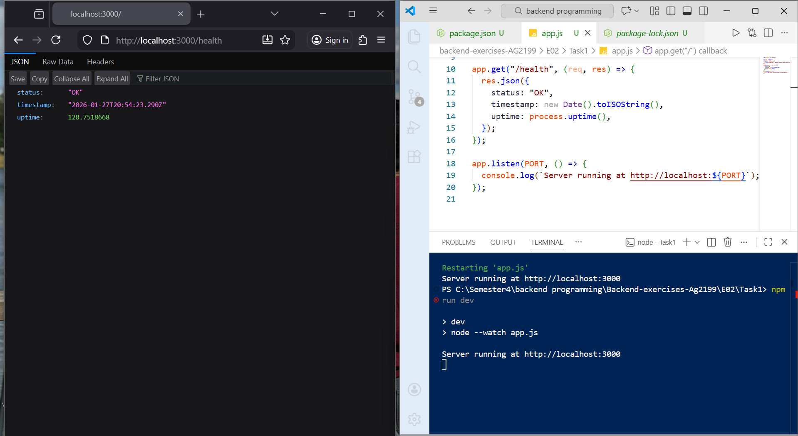


## Task 2

In Task 2, I continued working with the same Express server from Task 1.  
Instead of creating a new project, I expanded my existing server by adding more routes and practicing route parameters.

I created a simple user API using sample user data and implemented the following endpoints:

- `/api/users` to return all users in JSON format  
- `/api/users/:id` to return one specific user by ID  
- `/api/echo/:message` to return the message parameter as JSON  
- `/contact` to show my contact information in an HTML page  

I also added proper error handling.  
If the requested user ID does not exist, the server responds with a 404 status code

This task helped me understand how Express handles dynamic URLs and how to return different responses based on the request.

Screenshots of the output can be found below:

- 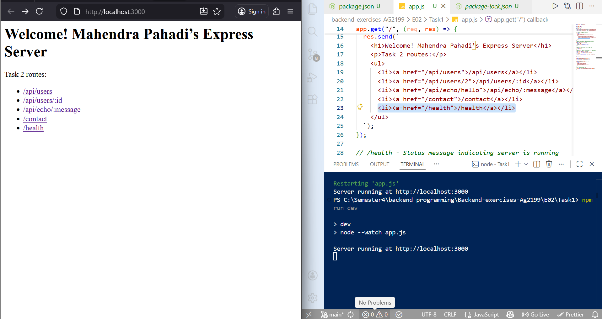

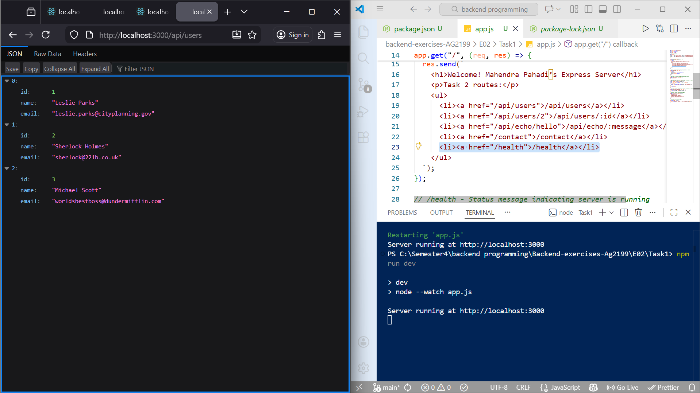

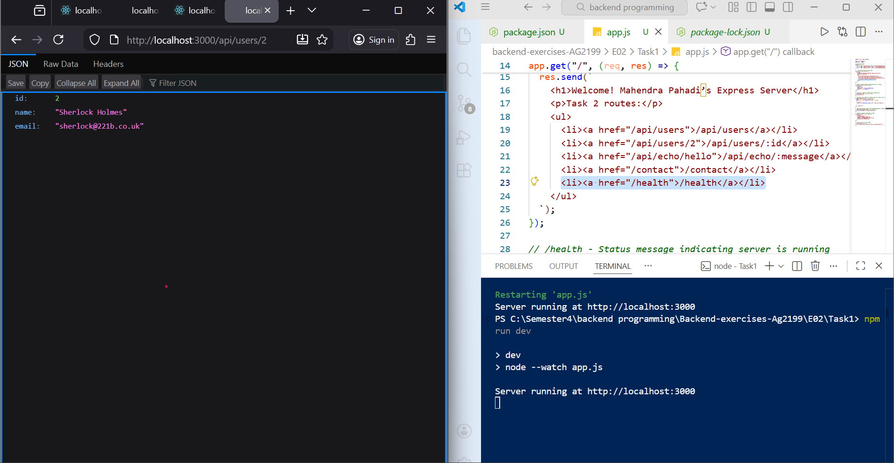

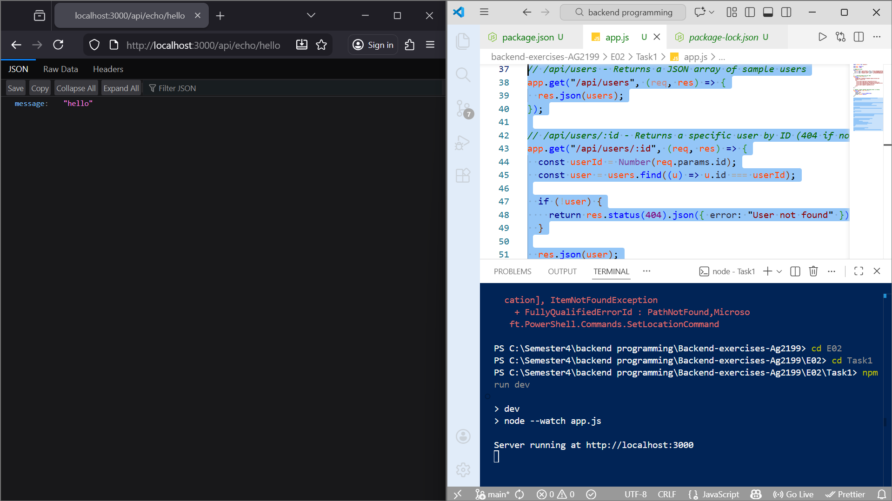

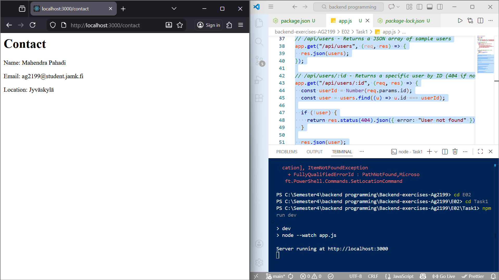

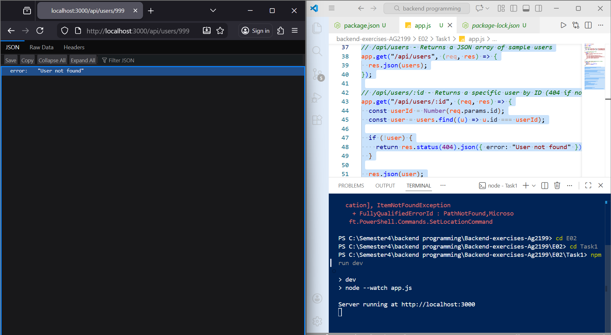

## Task 3 

In Task 3, I improved my Express application by adding support for JSON requests and serving static frontend files.

This task helped me understand how Express can handle POST requests and how a frontend page can interact with a backend API.

---
First, I added middleware to allow the server to read JSON data from incoming requests:

```js
app.use(express.json());
```

## Task 3 – Working with JSON and Static Files

In Task 3, I improved my Express application by adding support for JSON requests and serving static frontend files.

This task helped me understand how Express can handle POST requests and how a frontend page can interact with a backend API.

---

### JSON Middleware

First, I added middleware to allow the server to read JSON data from incoming requests:

```js
app.use(express.json());
```
This is required when working with POST or PUT requests that send JSON in the request body.

Serving Static Files
Next, I created a folder called public/ and added an index.html file inside it.

Then I enabled static file serving using:

app.use(express.static("public"));
This allows the browser to load the frontend page directly from the Express server.

POST Route – Add New Users
I implemented a POST endpoint:

POST /api/users

This endpoint allows adding a new user to the existing users array.

The server checks that both name and email are included in the request body.

Example error response:

```{
  "error": "Name and email are required"
}```
If the request is valid, the server creates a new user and responds with status code 201.

Frontend Testing with Fetch API
The public/index.html file contains a simple Fetch API example that loads users from:

/api/users

The users are displayed dynamically in the browser, making it easier to test the backend API.

Screenshots (Proof)
Screenshots of the working Task 3 output are shown below:

Frontend page loaded from public/index.html

API response from /api/users

POST request creating a new user

This task helped me learn how Express handles JSON request bodies, how to validate input data, and how static frontend files can be used to test API functionality.

## Serving Static Files
Next, I created a folder called public/ and added an index.html file inside it.

Then I enabled static file serving using: ```app.use(express.static("public"));```

This allows the browser to load the frontend page directly from the Express server.
 
 ## POST Route – Add New Users
 POST Route – Add New Users
 -POST /api/users

 This endpoint allows adding a new user to the existing users array.

The server checks that both name and email are included in the request body.

Example error response:

```{
  "error": "Name and email are required"
}
```


If the request is valid, the server creates a new user and responds with status code 201.

## Frontend Testing with Fetch API

The public/index.html file contains a simple Fetch API example that loads users from:

/api/users

The users are displayed dynamically in the browser, making it easier to test the backend API.

## Screenshots of the working Task 3 output are shown below:

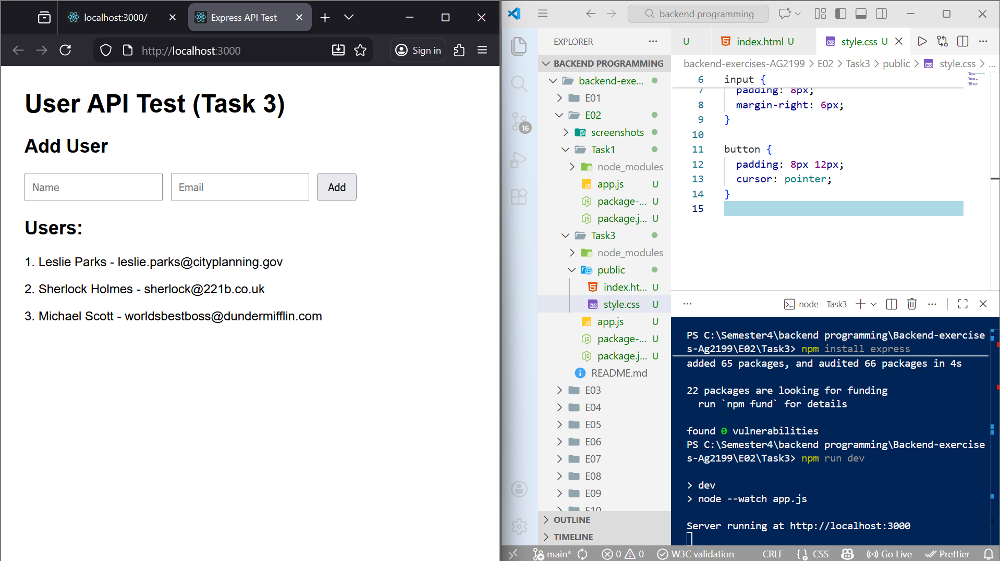

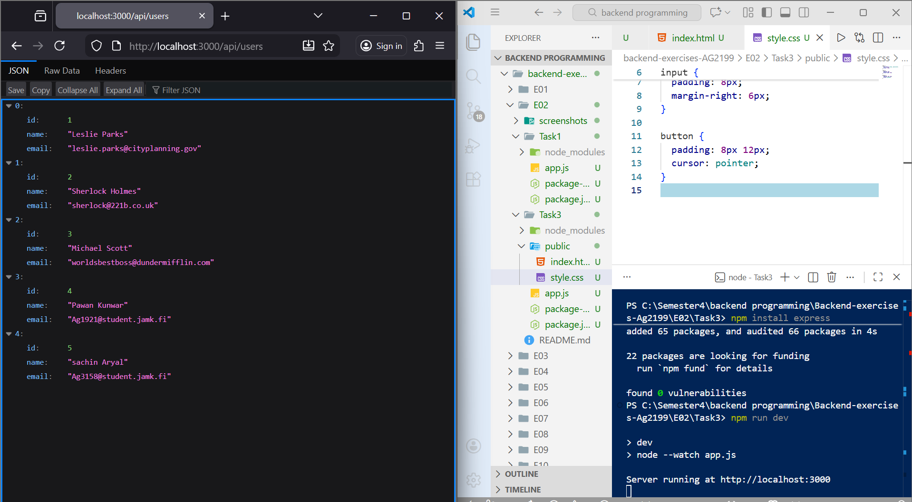


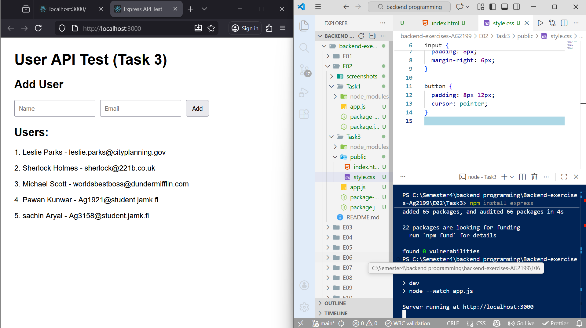

This task helped me learn how Express handles JSON request bodies, how to validate input data, and how static frontend files can be used to test API functionality.


## Task 4 

Task 4 was the compulsory and most important part of this exercise set.  
In this task, I created a complete REST API for managing a music album collection.

This API will be used as the foundation for the next tasks.

---

### Project Setup

First, I created a new Express project folder and installed Express.

I also added a `data/` directory where album information is stored in a JSON file:
*data/albums.json*

The album data is saved permanently, so changes remain even after restarting the server.

---

### Loading Album Data

To work with the JSON file, I used the `fs/promises` module.

I created a helper function to load albums:

```js
import fs from "fs/promises";

async function loadAlbums() {
  const data = await fs.readFile("./data/albums.json", "utf8");
  return JSON.parse(data).albums;
}
```
This function reads the file and returns the album array.

**CRUD Operations Implemented**
I implemented full CRUD functionality for albums.

The API supports the following endpoints:

|Method | Endpoint | Description          |
|-------|----------|-----------------------
|GET	| `/albums` |	Returns all albums |
|GET    | `/albums/:id`| Returns one album by ID |
|POST	| `/albums`	| Adds a new album  |
|PUT	| `/albums/:id` | Updates an existing album  |
|DELETE	| `/albums/:id` | Deletes an album  |

Example: GET All Albums

The /albums endpoint returns the full album collection in JSON format:

``` app.get("/albums", async (req, res) => {
  try {
    const albums = await loadAlbums();
    res.json(albums);
  } catch (error) {
    res.status(500).json({ error: "Failed to load albums" });
  }
});

```
** Testing the API **

All CRUD operations were tested using Thunder Client.

I confirmed that:

Albums can be created with POST

Existing albums can be updated with PUT

Albums can be removed with DELETE

Correct error messages are returned when an album ID is not found

This task helped me understand how REST APIs work with real data storage.

### Screenshots of the working Task 4 output are shown below:


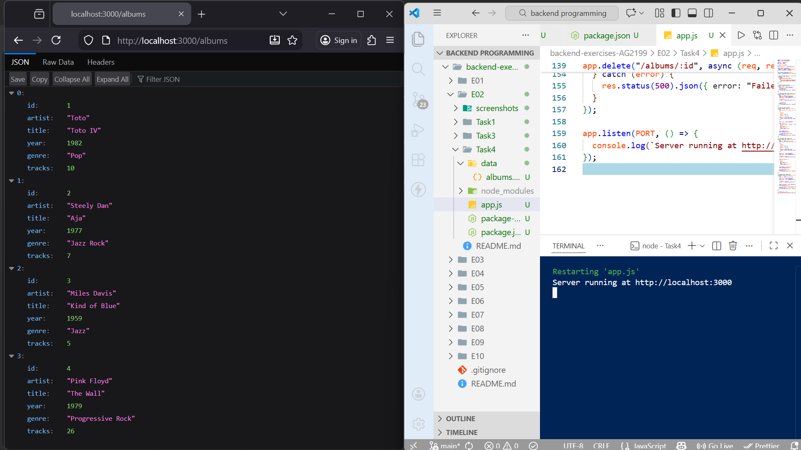

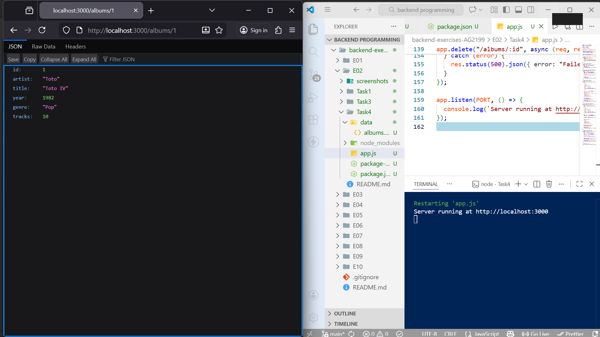

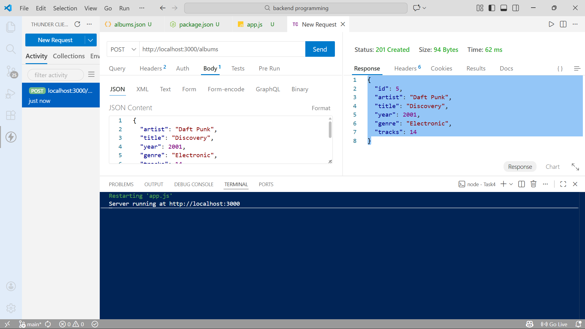

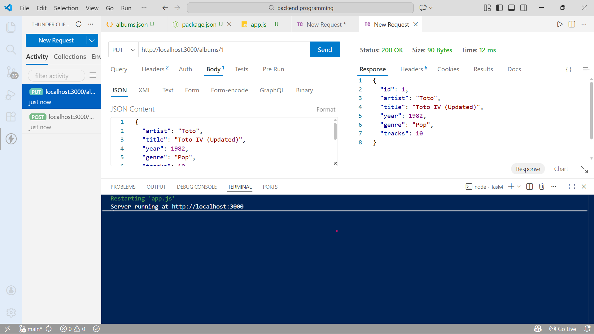

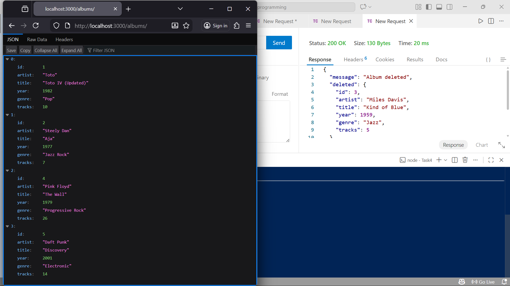

Overall, Task 4 gave me strong practice in building a complete Express CRUD API with persistent JSON file storage.


## Task 5 

In Task 5, I improved my Album API by refactoring the project into a cleaner and more professional structure.

Instead of writing all routes and logic inside one `app.js` file, I separated the code using **Express Router** and controllers.

This task helped me understand how real backend projects are organized.

---

### Project Organization

I created separate folders for routes, controllers, and data storage.

The final structure looks like this:
### Project Structure

```text
Task5/
├── app.js
├── routes/
│   └── albums.js
├── controllers/
│   └── albums.js
└── data/
    └── albums.json
```
---

### Controllers

All album business logic was moved into:

- `controllers/albums.js`

This file contains functions such as:

- `getAllAlbums()`
- `getAlbumById()`
- `createAlbum()`
- `updateAlbum()`
- `deleteAlbum()`

This keeps the logic separate from the route definitions.

---

### Routes

The route definitions were placed in:

- `routes/albums.js`

Example:

```js
import express from "express";
import * as albumController from "../controllers/albums.js";

const router = express.Router();

router.get("/", albumController.getAllAlbums);
router.get("/:id", albumController.getAlbumById);
router.post("/", albumController.createAlbum);
router.put("/:id", albumController.updateAlbum);
router.delete("/:id", albumController.deleteAlbum);

export default router;
```


** Updating app.js **

In the main app.js file, I mounted the router like this:

``` app.use("/albums", albumRoutes);
```
Now all album endpoints work through the router module.

** Testing **

After refactoring, I tested the API again to make sure everything still works correctly.

For example:

- GET /albums

- GET /albums/1

The responses remained the same, but the code structure became much cleaner.

## Screenshots of the working Task 5 output are shown below:


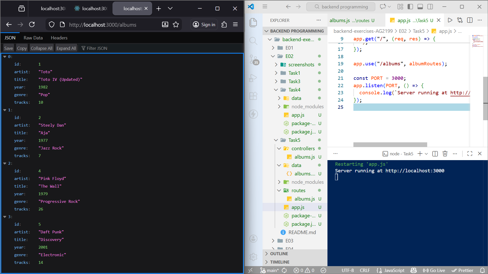

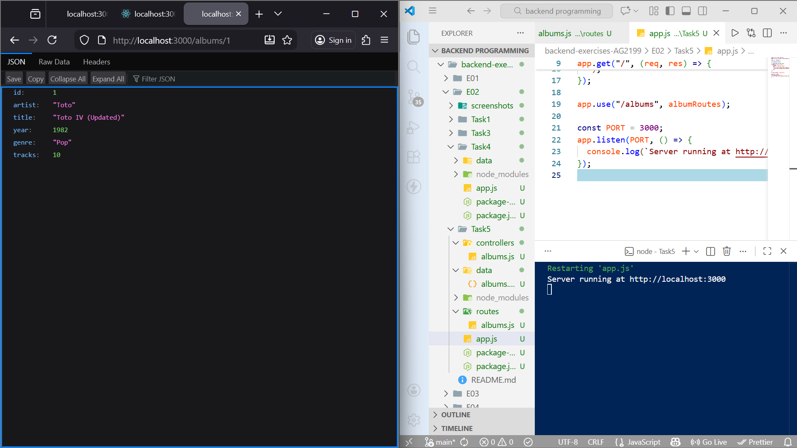


Overall, Task 5 helped me learn how to organize Express applications using routers and controllers, which is important for building larger backend projects.


## Task 6

In Task 6, I learned how to use middleware in Express.js.  
Middleware is useful because it allows the server to run extra logic before sending a response.

In this task, I implemented two custom middleware functions:

- A request logging middleware  
- A debug protection middleware for DELETE requests  

---

### Request Logger Middleware

First, I created a middleware that logs every request in the terminal.

It prints the timestamp, HTTP method, and URL:

```js
const requestLogger = (req, res, next) => {
  const timestamp = new Date().toISOString();
  console.log(`${timestamp} - ${req.method} ${req.url}`);
  next();
};
```
I added this middleware globally in app.js, so it runs for every request.

This helped me see all server activity while testing routes.


** Debug Middleware for DELETE **

Next, I created a middleware called requireDebug.

This middleware protects DELETE operations by requiring the query parameter:
```?debug=true
```
If debug mode is missing, the server returns an error:
```json{
  "error": "Debug mode required. Add ?debug=true to access this endpoint"
}
``` 
```js
const requireDebug = (req, res, next) => {
  const debug = req.query.debug;

  if (!debug || debug !== "true") {
    return res.status(400).json({
      error: "Debug mode required. Add ?debug=true to access this endpoint"
    });
  }

  next();
};
```

I applied this middleware only to the DELETE route in routes/albums.js.

** Testing the Middleware **

I tested the middleware using Thunder Client.

DELETE without debug → returns 400 error

DELETE with ?debug=true → album is deleted successfully

This task helped me understand how middleware can control access to specific endpoints.

### Screenshots of the working Task 6 output are shown below:

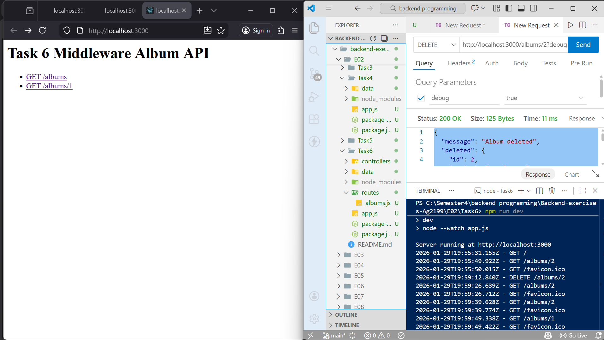

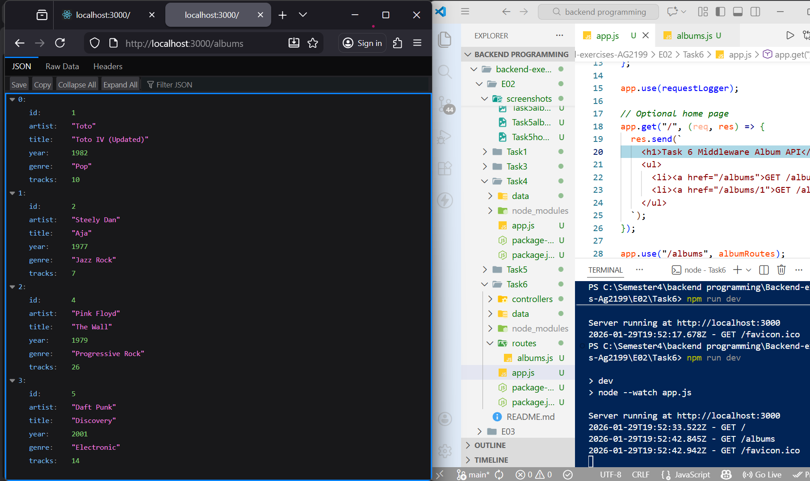

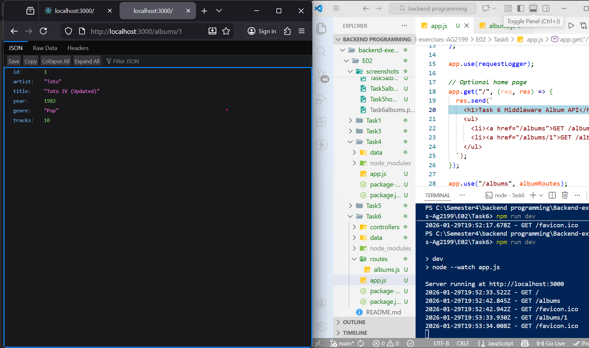

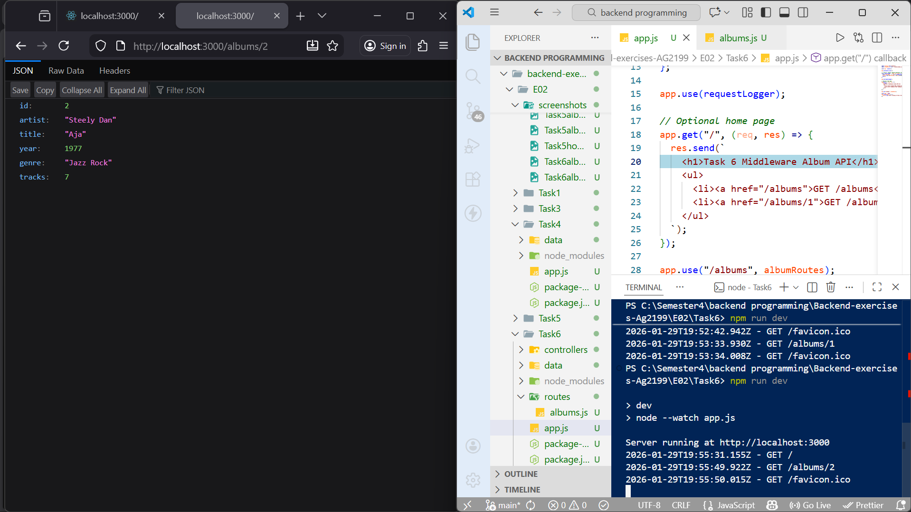

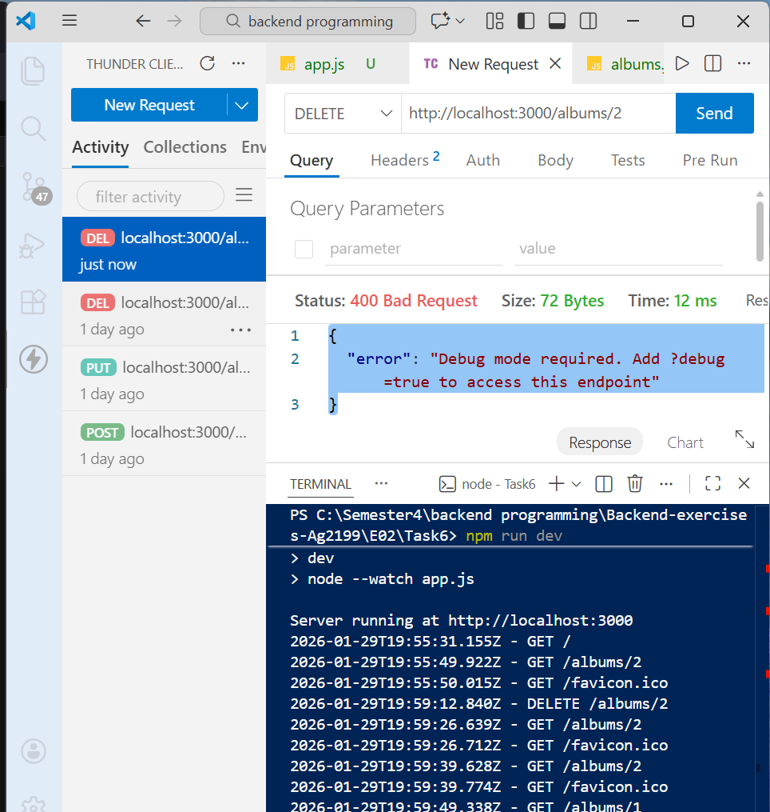

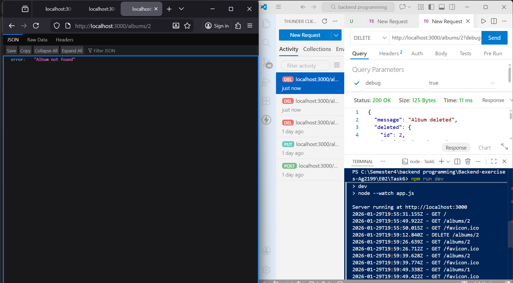

Overall, Task 6 showed me how middleware can be used for logging and for protecting sensitive API operations like DELETE.

## Task 7 

In Task 7, I connected a simple frontend interface with my Album API.  
The goal of this task was to interact with the backend using the Fetch API and create a small full-stack application.

This task helped me understand how frontend and backend can work together.

---

### Frontend Setup

I created a `public/` folder and updated the Express server to serve static files:

```js
app.use(express.static("public"));
```

This allows the browser to open the frontend page at: http://localhost:3000/

** Features Implemented **

The frontend interface can:

Display all albums from the API

Add a new album using a form

Delete albums using the required debug mode (?debug=true)

All actions are done using JavaScript and fetch() requests.

** Fetch API Usage **

To load albums from the backend, I used:
```js 
async function loadAlbums() {
  const response = await fetch("/albums");
  const albums = await response.json();
  displayAlbums(albums);
}
```
To add a new album, the frontend sends a POST request:
```js
await fetch("/albums", {
  method: "POST",
  headers: { "Content-Type": "application/json" },
  body: JSON.stringify(albumData)
});
```
To delete an album, the frontend uses:
```js
await fetch(`/albums/${id}?debug=true`, {
  method: "DELETE"
});
```
This ensures the DELETE request follows the debug rule from Task 6.

** User Interface **

The albums are displayed dynamically in the browser, and the page updates automatically after adding or deleting an album.

I also improved the design using CSS so that the interface looks clean and easy to use.

### Screenshots of the working Task 7 output are shown below:

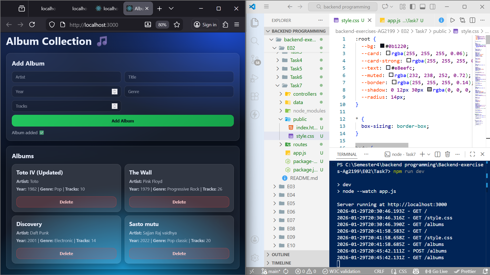

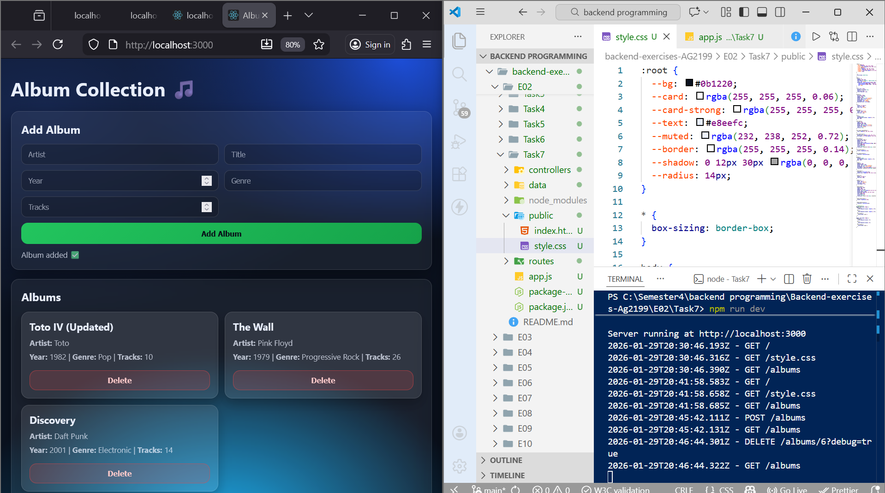

Overall, Task 7 helped me understand how a frontend application can communicate with an Express backend API using real HTTP requests.

*** AI Usage ***

I used AI tools for about 20% of the work.
AI helped mainly with:

Understanding Express routing and middleware

Improving code organization

Supporting frontend fetch examples

However, all code was written, tested, and understood by me.

### Conclusion

This exercise set helped me learn the most important Express.js basics.

Now I understand how to:

Build REST APIs with Express

Organize backend code using routers and controllers

Use middleware for logging and protection

Connect frontend and backend using Fetch API

Overall, this was a very useful introduction to real backend development.