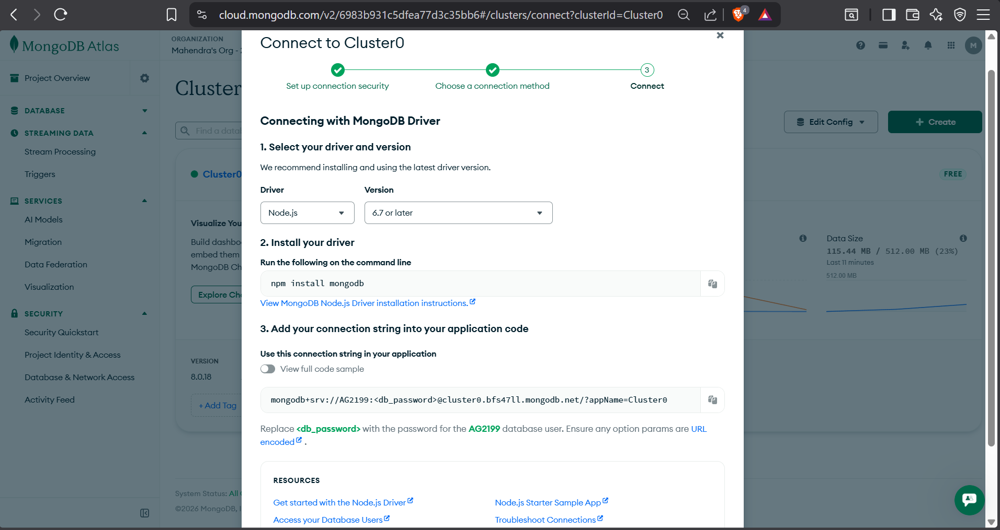
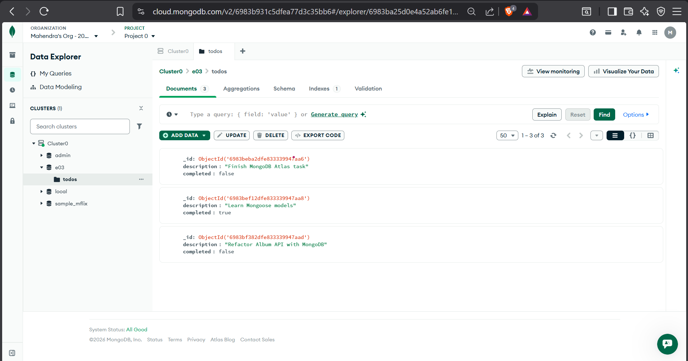
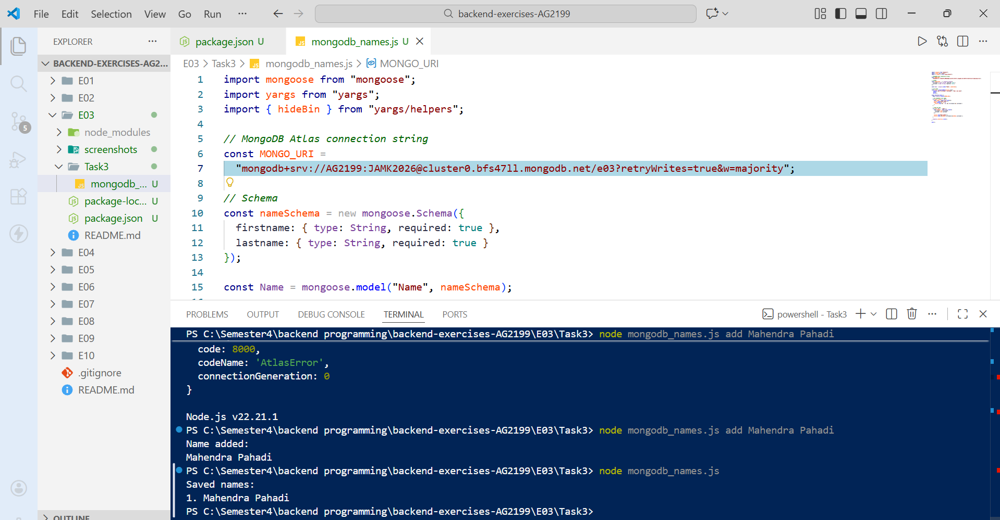
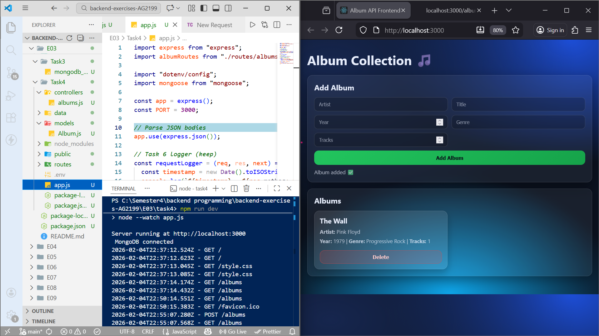
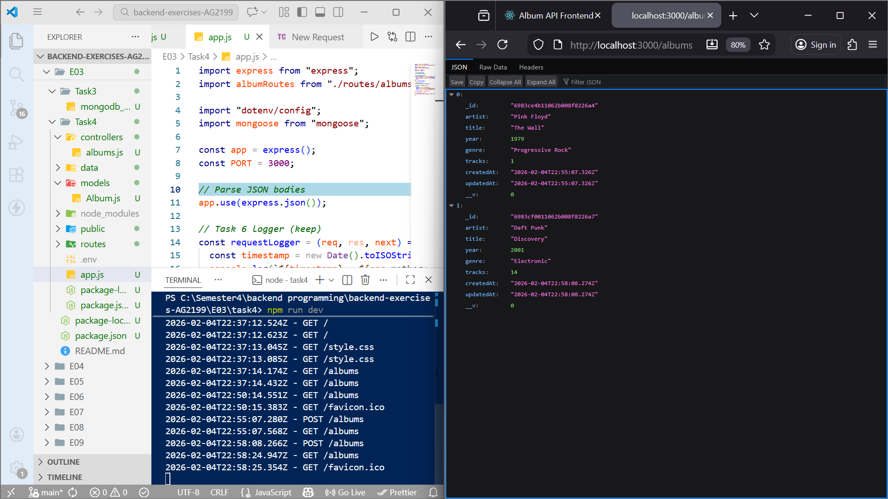
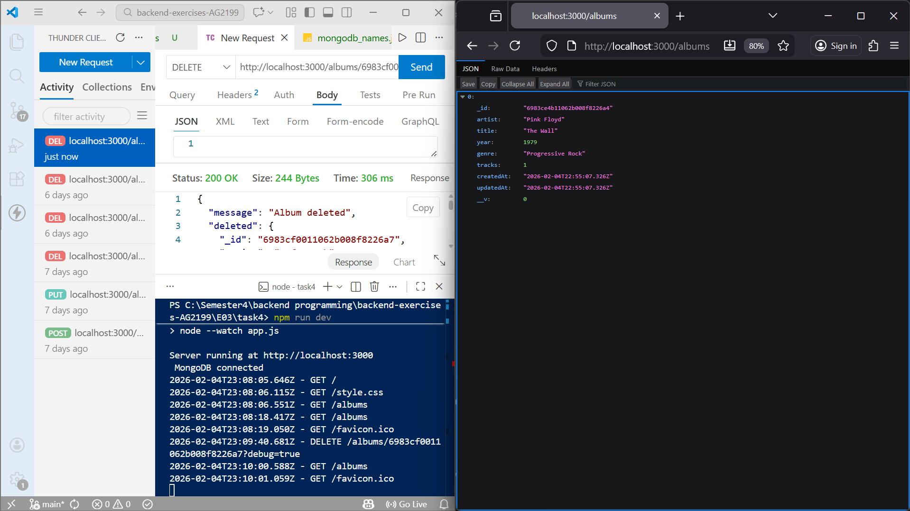

# Exercise set 03

**Mahendra Pahadi**  
Backend Programming – JAMK University of Applied Sciences  
Spring 2026 

----

## Introduction

This document explains how I completed **Exercise Set 03**.  
The goal of this exercise was to learn how to use **MongoDB Atlas** together with **Mongoose** in a Node.js application and to replace file-based or in-memory data with a real database.

All tasks were implemented step by step and tested using **Visual Studio Code**, **Thunder Client**, and **MongoDB Atlas**.

---

## Technologies Used

- Node.js (ES modules)
- MongoDB Atlas
- Mongoose
- Express.js
- Thunder Client (API testing)
- Visual Studio Code

---

## Task 1 – MongoDB Atlas Setup (1p)

In Task 1, I created a **free MongoDB Atlas cluster**.  
I configured database access by:

- Creating a database user
- Allowing my current IP address to access the cluster

After the setup, I successfully connected my local Node.js application to MongoDB Atlas using a connection string.

*Screenshot shows successful cluster setup and connection configuration.*

- 

---

## Task 2 – Create Database and Collection (2p)

In Task 2, I created a new database called **e03** in MongoDB Atlas.  
Inside this database, I created a collection named **todos**.

Each todo document contains:
- `description` (string)
- `completed` (boolean)

I manually added multiple todo documents through the Atlas web interface to verify that the database and collection were working correctly.

📸 *Screenshot shows the `todos` collection with multiple documents.*

- 

---

## Task 3 – CLI Application with MongoDB (5p)

In Task 3, I developed a **Node.js command-line application** that interacts with MongoDB using **Mongoose**.

### Functionality
- If the program is run **without arguments**, it lists all saved names from the database.
- If the program is run with arguments, it adds a new name to the database.

Example commands:
```bash
node mongodb_names.js add Mahendra Pahadi
node mongodb_names.js
```

** Implementation details **

- Mongoose is used to define a schema with firstname and lastname

- The application connects to MongoDB Atlas

- Yargs is used to handle command-line arguments

- All data is stored permanently in MongoDB

**Screenshot shows adding a name and listing names in the same terminal.**

- 


## Task 4 – Refactor Album API with Mongoose (7p)

In Task 4, I refactored my Album API from Exercise Set 02 to use **MongoDB and Mongoose** instead of arrays or JSON files.  
The main goal of this task was to replace file-based data handling with a real database and implement full CRUD functionality using Mongoose.

---

### MongoDB and Mongoose Setup

I connected the application to **MongoDB Atlas** using Mongoose.  
The database connection string is stored in a `.env` file to keep sensitive information secure.

When the server starts, the terminal confirms that the connection is successful by displaying:
MongoDB connected

---

### Album Schema and Model

I created a Mongoose schema and model for albums.  
This schema defines the structure of an album document and ensures data consistency.

Each album contains the following fields:

- `artist` (String, required)
- `title` (String, required)
- `year` (Number)
- `genre` (String)
- `tracks` (Number)

MongoDB automatically adds additional fields such as `_id`, `createdAt`, and `updatedAt`.

---

### CRUD Operations

The Album API supports full CRUD functionality using Mongoose methods.

| Method | Endpoint | Description |
|------|---------|-------------|
| GET | `/albums` | Returns all albums |
| GET | `/albums/:id` | Returns a single album by ID |
| POST | `/albums` | Creates a new album |
| PUT | `/albums/:id` | Updates an existing album |
| DELETE | `/albums/:id` | Deletes an album |

The following Mongoose methods were used:
- `find()` to retrieve all albums
- `findById()` to retrieve a single album
- `create()` to add a new album
- `findByIdAndUpdate()` to update an album
- `findByIdAndDelete()` to delete an album

---

### Testing and Verification

I tested the API using **Thunder Client** and the frontend interface.

- New albums can be added successfully and are stored in MongoDB
- Albums are retrieved with MongoDB-generated `_id` values
- Albums can be updated and deleted correctly
- Deleted albums are removed from both the API response and the database

All operations were verified through:
- API responses in Thunder Client
- Console logs in the terminal
- MongoDB Atlas collection view

**Screenshots are included below to demonstrate POST, GET, and DELETE operations.**

- 

- 

- 

---

### Summary

By completing this task, I successfully replaced file-based album storage with a MongoDB database.  
This task helped me understand how Mongoose models, schemas, and CRUD methods work together in a real backend application.

## AI Usage

I used AI tools for **approximately 10** of this exercise.

AI assistance was used mainly for:
- Understanding MongoDB Atlas and Mongoose concepts
- Clarifying error messages and connection issues
- Getting guidance on schema design and CRUD structure

All code was written, tested, and modified by me in Visual Studio Code.  
I understand how the database connection, models, controllers, and API routes work, and I am able to explain the logic behind each task.

---

## Final Notes

This exercise helped me gain practical experience with **MongoDB and Mongoose** in a real backend application.

Through these tasks, I learned:
- How to set up and use MongoDB Atlas as a cloud database
- How to define schemas and models using Mongoose
- How to perform full CRUD operations with a database
- How to refactor an existing Express API to use MongoDB instead of files or arrays
- How backend APIs and frontend interfaces can work together with a database

All tasks were completed step by step and carefully tested using the terminal, browser, Thunder Client, and MongoDB Atlas.  
This exercise improved my confidence in building database-driven backend applications using modern JavaScript tools.

