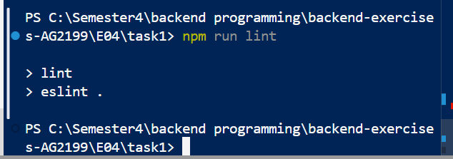
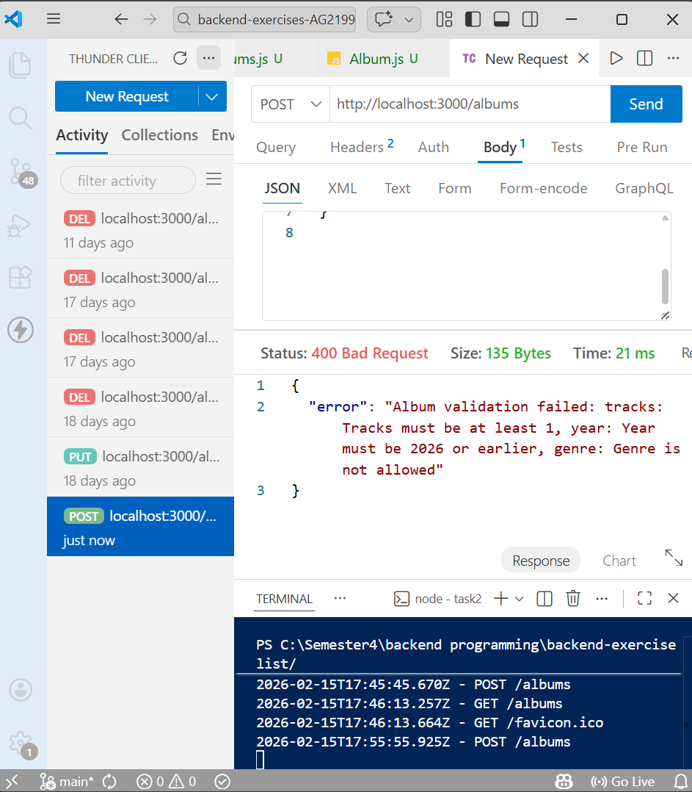
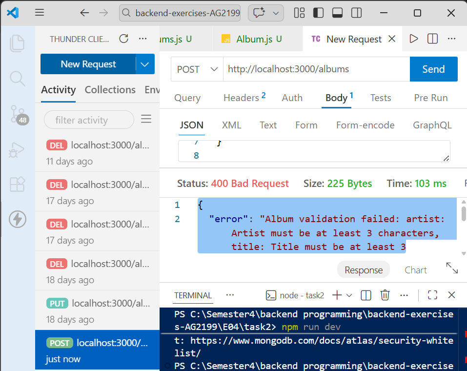
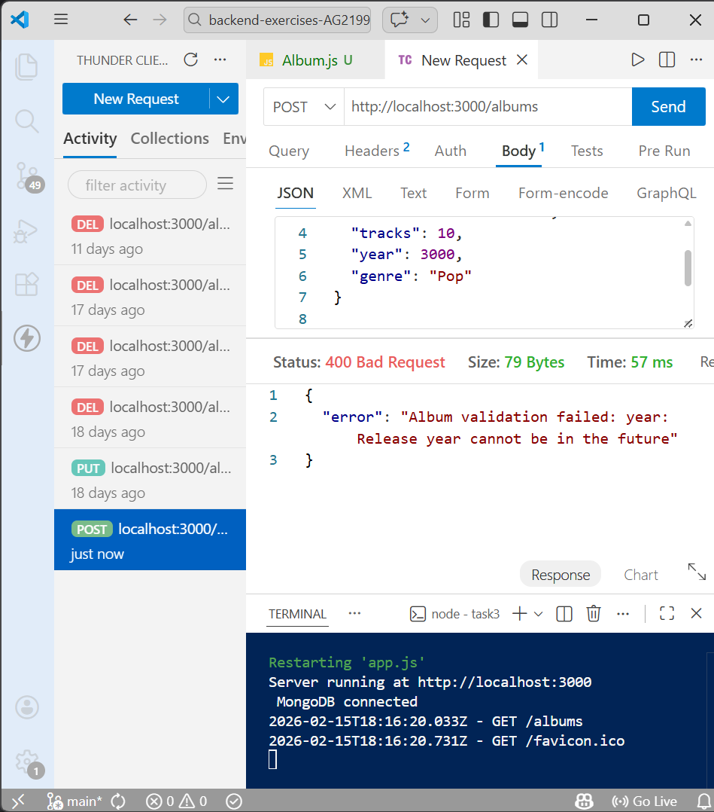
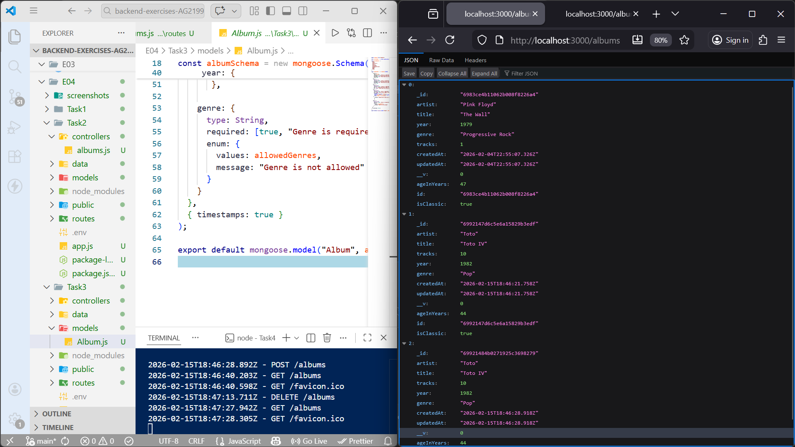
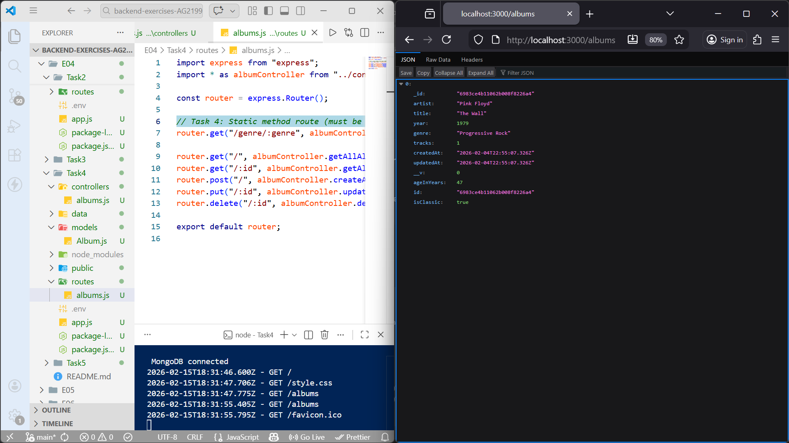
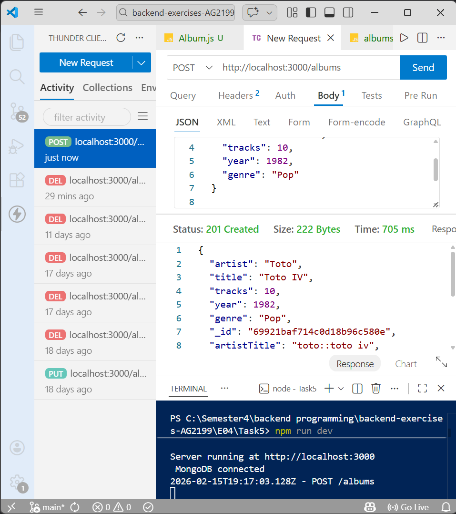
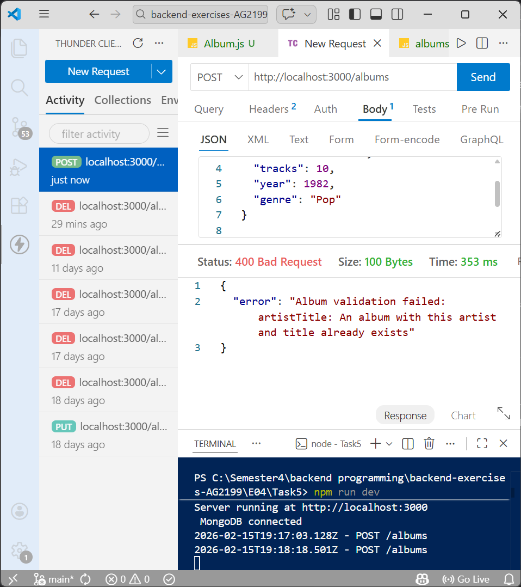

# Exercise set 04

**Mahendra Pahadi**  
Backend Programming – JAMK University of Applied Sciences  
Spring 2026 

----
## Introduction
In this exercise set, I continued developing my Album API project built with Node.js, Express, MongoDB, and Mongoose.
The purpose of this assignment was to improve data quality and reliability by adding validation rules, linting, and advanced schema logic.

In previous exercises, the API was able to store and retrieve albums, but it did not fully protect the database from invalid or duplicate data.
Therefore, in this exercise I focused on making the backend more robust and closer to a real production system.

During the tasks I implemented:

ESLint code checking

Field validation rules in Mongoose

Custom validation functions

Schema virtual properties and methods

Duplicate data prevention using async validation

Each task was implemented step by step and tested using the browser and Thunder Client to make sure the API behaved correctly.

----

## Task 1
In this task, I installed and configured ESLint for my Node.js project.

First, I installed ESLint: npm install --save-dev eslint

Then I created the configuration: Then I created the configuration:

-I selected:

-JavaScript

-Problems only

-ES Modules

-Node environment

After that, I added a script inside package.json:

```json
"scripts": {
  "lint": "eslint ."
}
```
Then I ran: npm run lint

ESLint showed some unused variable errors, especially in catch blocks.
I fixed them by either removing the variable or using it correctly.

Finally, the linter ran successfully with no errors.

**Learning result**: I learned how linting helps detect mistakes early and keeps the code clean and consistent.

**Screenshot**: Lint command running without errors is shown below.

- 

## Task 2
In this task, I added validation rules to the Album schema to make sure only valid data can be saved.

I updated models/Album.js and added these validations:

-Artist: required, min 3 characters, max 50

-Title: required, min 3 characters, max 50

-Tracks: must be between 1 and 100

-Year: must be between 1900 and current year

-Genre: must belong to an allowed list
Example:
```js
artist: {
  type: String,
  required: [true, "Artist is required"],
  minlength: [3, "Artist must be at least 3 characters"],
  maxlength: [50, "Artist must be at most 50 characters"]
}
```
I tested the validation using Thunder Client by sending incorrect data.

Example invalid request: 
```json
{
  "artist": "AB",
  "title": "X",
  "tracks": 0,
  "year": 3000,
  "genre": "Unknown"
}
```
The server correctly returned a validation error.

**Learning result**
I understood how schema validation protects the database from bad input.

**Screenshots**
Validation errors for artist/title and tracks/year/genre are shown below.

- 

- 


## Task 3
In this task, I created a custom validator to prevent albums from having a future release year.

Instead of only using max, I added a custom function:
```js
validate: {
  validator: function(value) {
    return value <= new Date().getFullYear();
  },
  message: "Release year cannot be in the future"
}
```
I tested by sending:
```json
{
  "artist": "Future Artist",
  "title": "Future Album",
  "tracks": 10,
  "year": 3000,
  "genre": "Pop"
}
```
The API returned the custom error message.

**Learning result**
I learned how to create my own validation logic inside a schema.

**Screenshot**
Custom year validation error is shown below.

- 

## Task 4
In this task, I added extra functionality to the schema.

Virtual property

I created a virtual field ageInYears:
```js
albumSchema.virtual("ageInYears").get(function () {
  return new Date().getFullYear() - this.year;
});
```
Instance method

I created a method isClassic() that returns true if album age is more than 25 years:
```js
albumSchema.methods.isClassic = function () {
  return this.ageInYears > 25;
};
```
Static method

I created findByGenre(genre) to filter albums:
```js
albumSchema.statics.findByGenre = function (genre) {
  return this.find({ genre }).exec();
};
```
I added a route:
GET /albums/genre/:genre

Testing:

-/albums shows all albums with ageInYears and isClassic

-/albums/genre/Progressive Rock shows filtered albums

**Learning result**
I learned the difference between virtuals, instance methods, and static methods.

**Screenshots**
Album list and filtered genre results are shown below.

- 

- 


## Task 5
In this final task, I prevented duplicate albums with the same artist and title.

I created a combined field artistTitle and used an async validator:
```js
validate: {
  validator: async function (value) {
    const existing = await this.constructor.findOne({
      artistTitle: value,
      _id: { $ne: this._id }
    });
    return !existing;
  },
  message: "An album with this artist and title already exists"
}
```
I also used schema hooks to automatically build artistTitle before saving.

Test:

First POST → success

Second identical POST → error

**Learning result**
I learned how to perform database checks inside validation and prevent duplicates.

**Screenshot**
Duplicate album error is shown below.

- 

- 

## AI Usage
I used AI assistance approximately 20% of the time.

AI helped me:

-Understand validation logic

-Fix middleware errors

-Debug MongoDB connection problems

-Improve schema structure

However, I personally implemented, tested, and verified all code.

## Final Reflection

This exercise helped me understand how professional backend systems protect data.

I learned:

-Code linting and debugging

-Schema validation

-Custom validators

-Virtual properties and methods

-Preventing duplicate database entries

