# Exercise set 05

**Mahendra Pahadi**  
Backend Programming – JAMK University of Applied Sciences  
Spring 2026 

----
## Introduction
In this exercise set, I continued developing my Album REST API project using Node.js, Express, MongoDB, and Mongoose.

The main goal of this assignment was to improve the API by adding advanced query features. In the previous exercise, I focused mainly on schema validation and data protection. In this exercise, the focus was on improving how users can retrieve and filter data from the database.

The purpose was to make the API more flexible, efficient, and closer to a real-world production API.

During this exercise, I implemented:

Sorting functionality

Exact year filtering

Field selection

Text search using regular expressions

Filtering between two years

Pagination with metadata

Each task was implemented step by step and tested using the browser to make sure the API behaved correctly.


## Task 1

In this task, I implemented sorting functionality for the Album API using query parameters. The purpose of this task was to allow users to sort albums dynamically based on different fields.

Previously, the API returned albums in default database order. After this update, users can control the order of results by adding a `sort` parameter to the request URL.

### Example Requests

Sort albums by year in ascending order:

GET /albums?sort=year

Sort albums by year in descending order:

GET /albums?sort=-year

Sort by multiple fields (first by year, then by artist):

GET /albums?sort=year,artist

### Implementation

Inside the controller, I added logic to check if the `sort` query parameter exists. If it does, the value is converted into a format that MongoDB understands.

```js
if (req.query.sort) {
  const sortBy = req.query.sort.split(",").join(" ");
  query = query.sort(sortBy);
}
```
The split() function separates multiple fields, and join(" ") formats them correctly for Mongoose.

**Testing**

I tested the sorting feature using browser.
The API returned albums correctly sorted according to the selected field and direction.

**Learning Result**

In this task, I learned how to dynamically modify database queries using user input.
I also understood how sorting improves API usability and makes the backend more flexible for frontend applications.

**Screenshot**

Sorted album results are shown below:

- 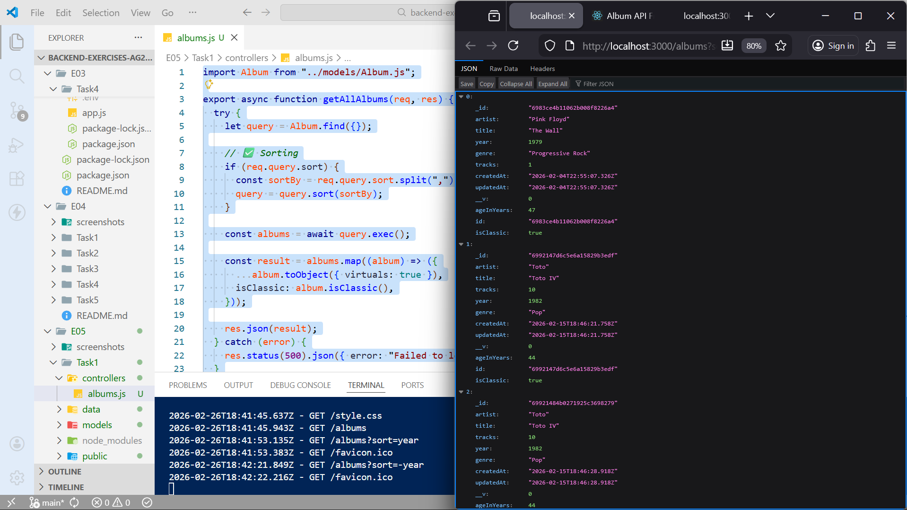

- 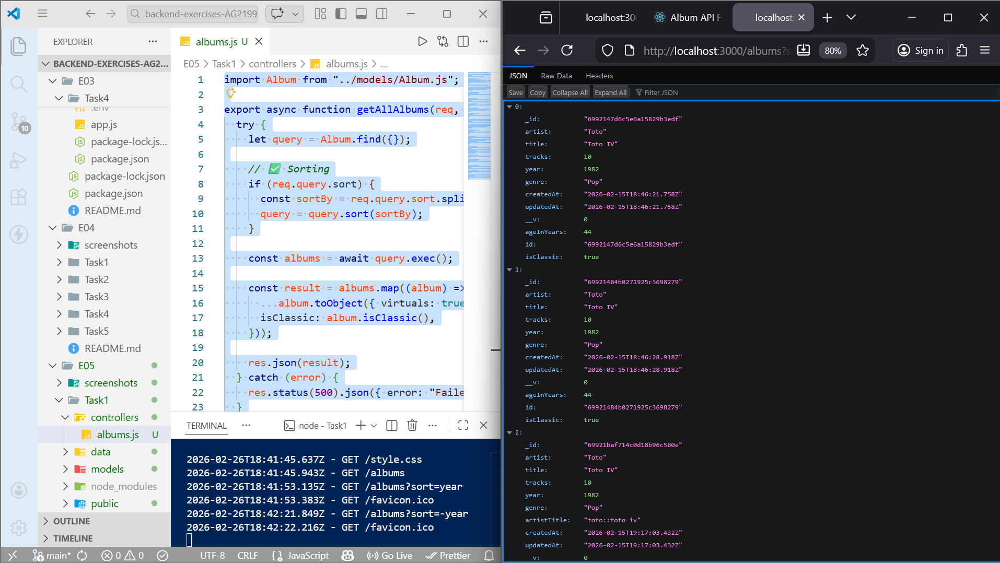


## Task 2

In this task, I implemented numeric filtering for the album release year.  
The purpose of this task was to allow users to retrieve albums from a specific year using a query parameter.

Previously, the API returned all albums unless another filter was applied. After this update, users can filter albums by providing a `year` parameter in the request URL.

### Example Request

Get albums released in 1980:

GET /albums?year=1980

This request returns only albums where the release year is exactly 1980.

### Implementation

Inside the controller, I created a filter object and checked if the `year` query parameter exists.  
If it exists, the value is converted into a number and added to the filter.

```js
let filter = {};

if (req.query.year) {
  filter.year = Number(req.query.year);
}

let query = Album.find(filter);
```
Using Number() ensures that the year is treated as a numeric value instead of a string.

**Testing**

I tested the year filtering using browser.
When I sent a request with a specific year, the API returned only albums released in that year.
I also tested combining this filter with sorting, and both features worked correctly together.

**Learning Result**

In this task, I learned how to apply numeric filters in MongoDB queries.
I also understood the importance of converting query parameters into the correct data type before using them in database operations.

**Screenshot**

Year filtering result is shown below:

- 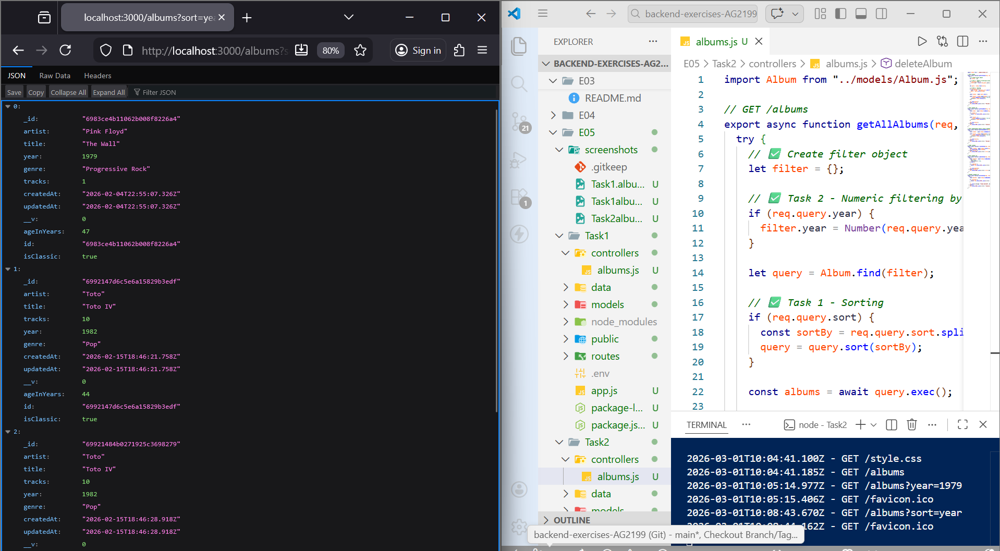

- 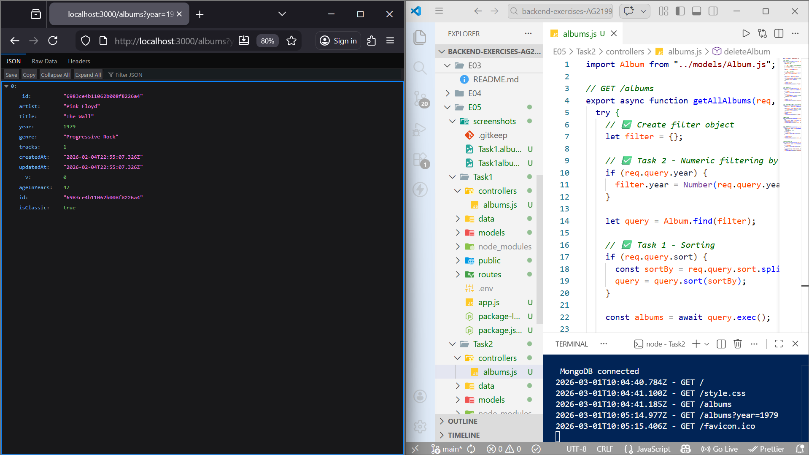

- 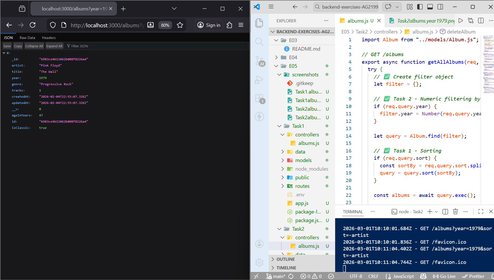


## Task 3

In this task, I implemented field selection functionality for the Album API.  
The purpose of this feature is to allow users to choose which fields should be returned in the response.

Previously, the API always returned all album fields. After this update, users can request only specific fields, which improves performance and reduces unnecessary data transfer.

### Example Request

Return only artist and title:

GET /albums?fields=artist,title

The response will include only the selected fields for each album.

### Implementation

Inside the controller, I checked whether the `fields` query parameter exists.  
If it exists, I split the fields by commas and convert them into a format that Mongoose understands.

```js
if (req.query.fields) {
  const fields = req.query.fields.split(",").join(" ");
  query = query.select(fields);
}
```
The select() method tells Mongoose which fields should be included in the response.

**Testing**

I tested this feature using firefox browser by requesting different combinations of fields.

For example:

GET /albums?fields=artist,year
GET /albums?fields=title,genre

The API correctly returned only the requested fields.

I also tested combining field selection with sorting and filtering, and all features worked together correctly.

**Learning Result**

In this task, I learned how to use Mongoose’s select() method to control response structure.
I also understood how field selection improves API efficiency and gives more flexibility to frontend developers.

**Screenshot**

Field selection results are shown below:

- 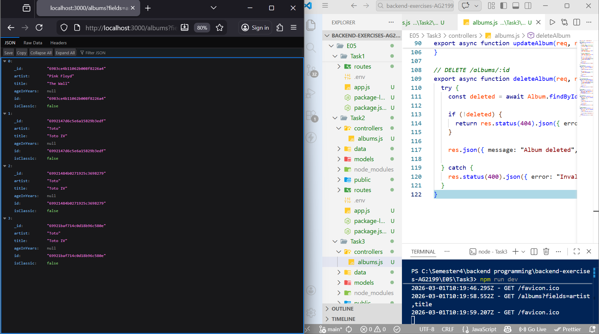

- 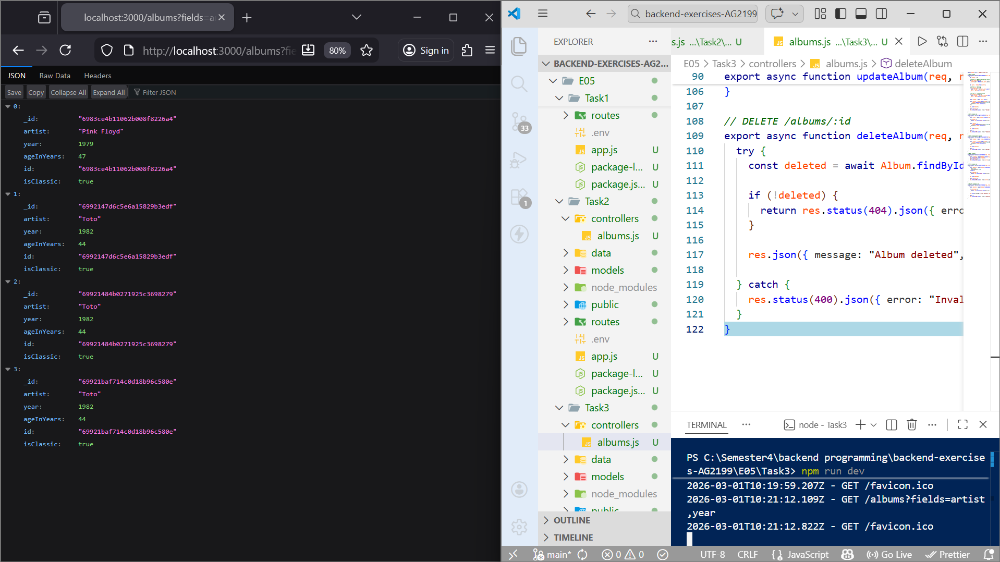

- 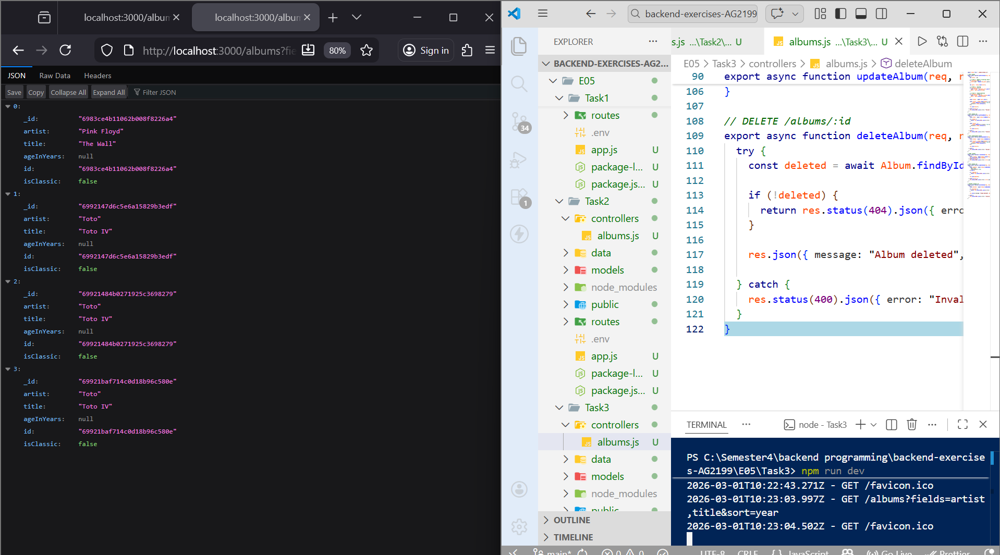


## Task 4

In this task, I implemented a search functionality using regular expressions (regex).  
The purpose of this feature is to allow users to search albums by artist name or album title using partial text.

Previously, users could only filter albums using exact values. After this update, the API supports flexible searching with partial matches.

### Example Request

Search for albums containing the text "tot":

GET /albums?search=tot

This request returns albums where:

- The artist name contains "tot", or  
- The album title contains "tot"

The search is case-insensitive, meaning it works for both uppercase and lowercase letters.

### Implementation

Inside the controller, I checked whether the `search` query parameter exists.  
If it exists, I used MongoDB’s `$regex` operator with the `$or` condition.

```js
if (req.query.search) {
  filter.$or = [
    { artist: { $regex: req.query.search, $options: "i" } },
    { title: { $regex: req.query.search, $options: "i" } }
  ];
}
```
- $regex allows partial matching

- $options: "i" makes the search case-insensitive

- $or ensures that either the artist or title can match

**Testing**

I tested the search feature using browser.

Examples tested:

GET /albums?search=wall
GET /albums?search=tot

The API correctly returned albums matching the search pattern.

I also tested combining search with sorting, field selection, and year filtering. All features worked correctly together.

**Learning Result**

In this task, I learned how to use regular expressions in MongoDB queries.
I also understood how flexible search functionality improves user experience and makes the API more powerful.

**Screenshot**

Search results using regex are shown below:

- 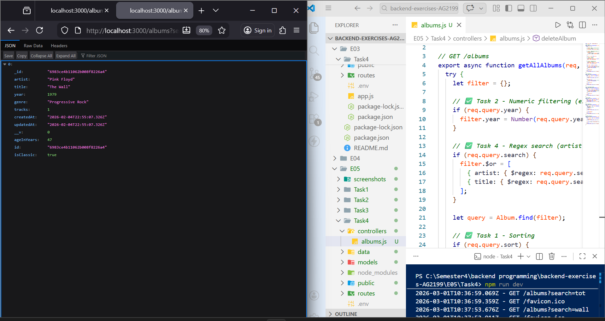

- 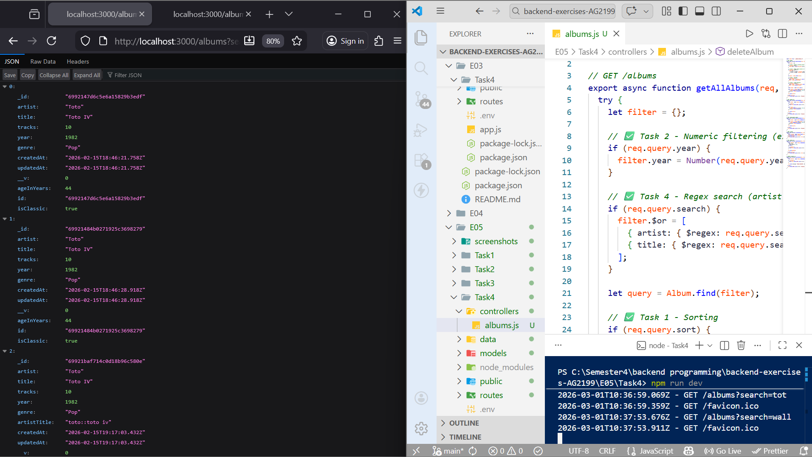

- 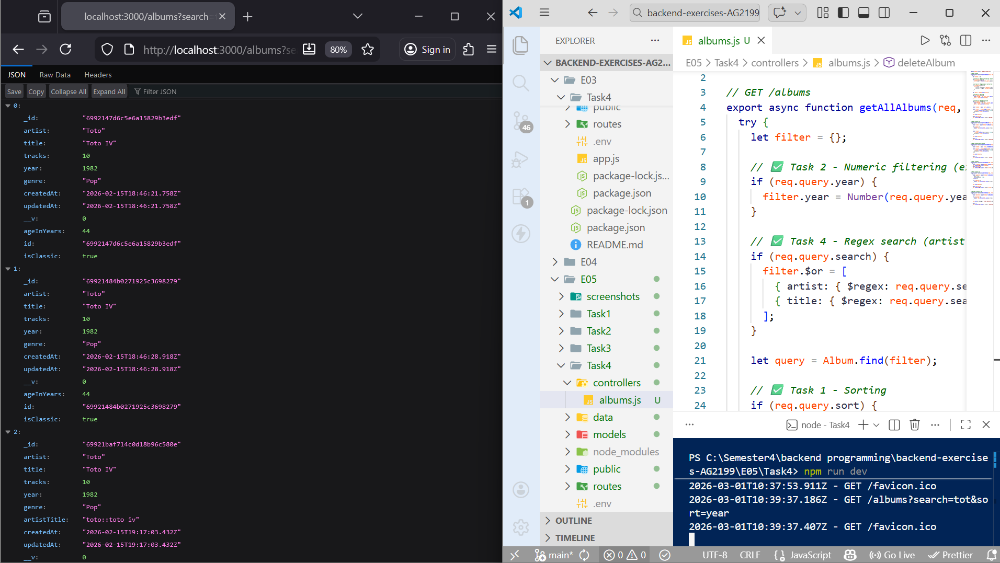

- 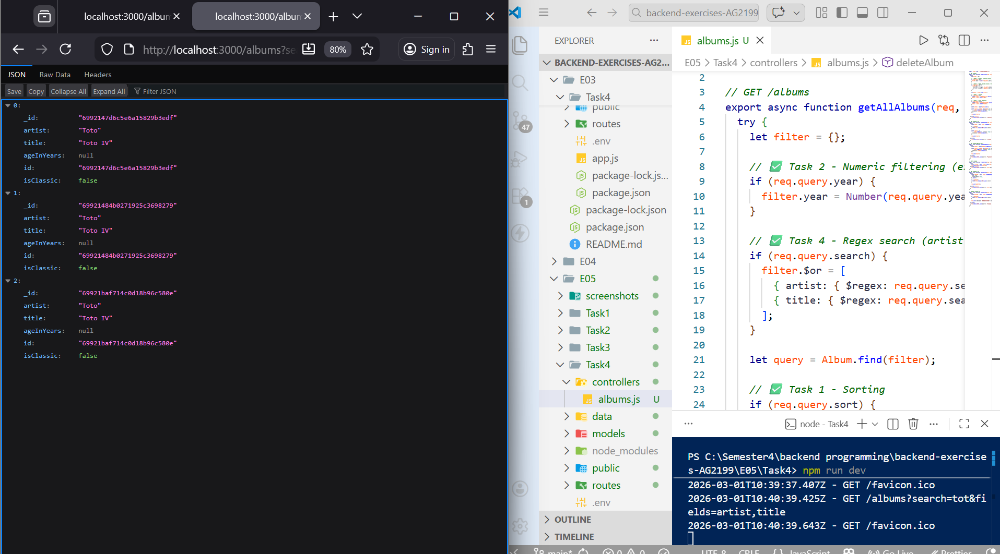


## Task 5 

In this task, I implemented an advanced filtering feature that allows users to retrieve albums released between two specific years.

The purpose of this task was to improve the flexibility of the API. Instead of filtering by only one exact year, users can now define a year range using `startYear` and `endYear` query parameters.

This makes the API more practical and closer to real-world backend systems.

### Example Requests

Filter albums released between 1970 and 1980:

GET /albums?startYear=1970&endYear=1980

Filter albums released from 1990 onwards:

GET /albums?startYear=1990

Filter albums released before 2000:

GET /albums?endYear=2000

### Implementation

Inside the controller, I checked whether `startYear` or `endYear` exists in the query parameters.  
If either of them exists, I created a dynamic filter using MongoDB comparison operators.

```js
if (req.query.startYear || req.query.endYear) {
  filter.year = {};

  if (req.query.startYear) {
    filter.year.$gte = Number(req.query.startYear);
  }

  if (req.query.endYear) {
    filter.year.$lte = Number(req.query.endYear);
  }
}
```
$gte means "greater than or equal to"

$lte means "less than or equal to"

Using Number() ensures the values are treated as numeric data.

**Testing**

I tested this feature using browser with different combinations:

GET /albums?startYear=1970&endYear=1980
GET /albums?startYear=1985
GET /albums?endYear=1995

The API correctly returned albums that matched the defined year range.

I also tested combining this filter with search, sorting, and pagination. All features worked correctly together.

**Learning Result**

In this task, I learned how to build dynamic range queries using MongoDB comparison operators.
I also understood how multiple query parameters can be combined to create flexible and powerful filtering systems.

**Screenshot**

Year range filtering results are shown below:

- 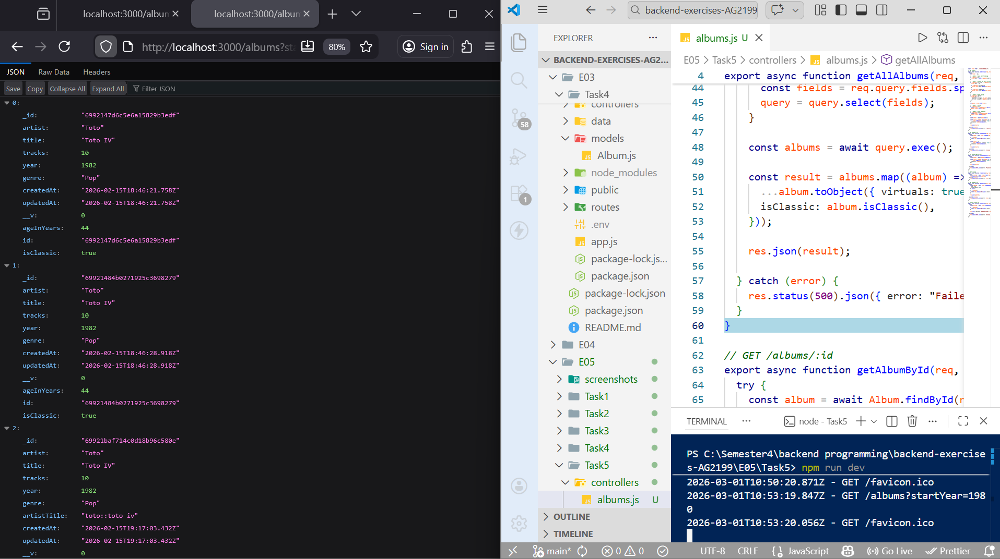

- 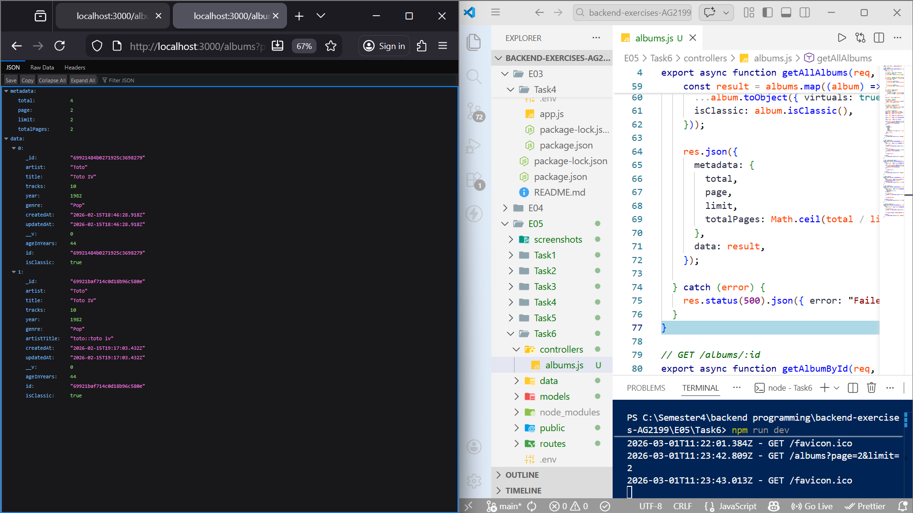

- 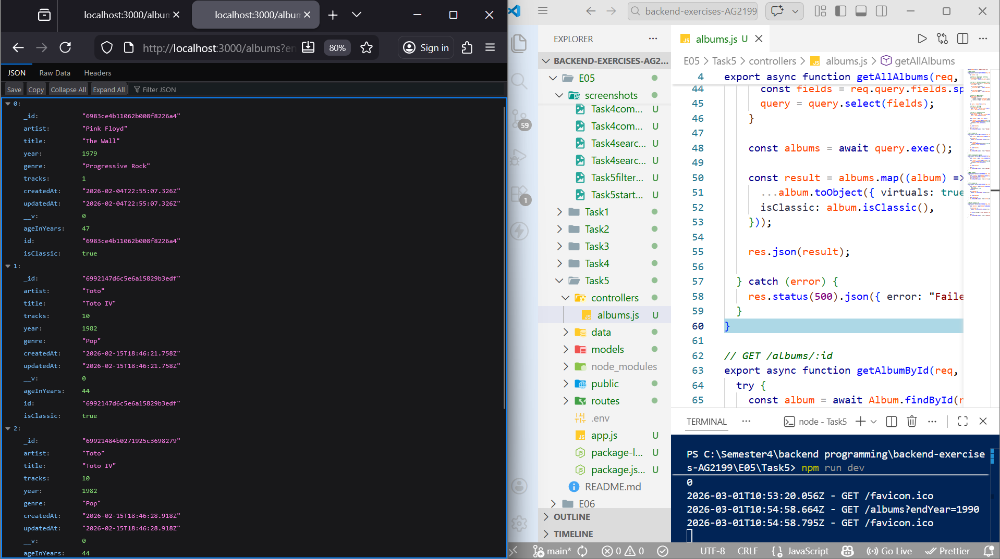

- 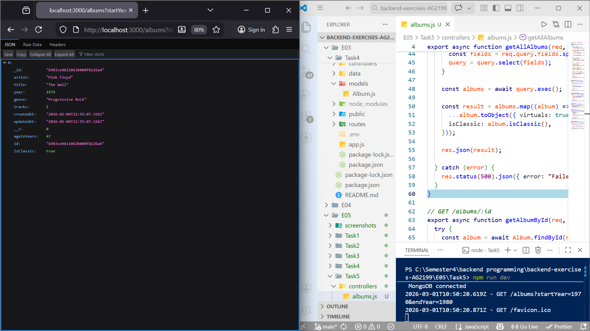

- 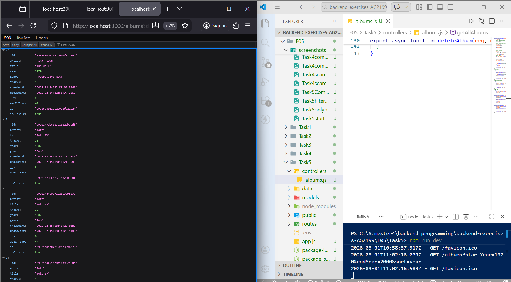

- 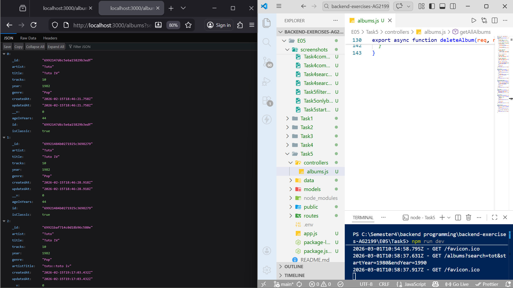


## Task 6 

In this final task, I implemented pagination functionality for the Album API.  
The purpose of pagination is to limit the number of results returned in a single request, which improves performance and makes the API suitable for large datasets.

Instead of returning all albums at once, users can now request data page by page using the `page` and `limit` query parameters.

### Example Request

Get the first page with 5 albums per page:

GET /albums?page=1&limit=5

Get the second page with 5 albums per page:

GET /albums?page=2&limit=5

### Implementation

Inside the controller, I calculated the page number, limit, and skip value.

```js
const page = Number(req.query.page) || 1;
const limit = Number(req.query.limit) || 10;
const skip = (page - 1) * limit;

query = query.skip(skip).limit(limit);
```
page defines the current page number

limit defines how many results should be returned

skip tells MongoDB how many documents to ignore

I also added metadata to the response to provide useful pagination information.

const total = await Album.countDocuments(filter);
```js
res.json({
  metadata: {
    total,
    page,
    limit,
    totalPages: Math.ceil(total / limit)
  },
  data: result
});
```

The metadata includes:

- total → total number of matching documents

- page → current page number

- limit → number of items per page

- totalPages → total number of pages

**Testing**

I tested pagination using browser with different page and limit values.

Examples tested:

GET /albums?page=1&limit=3
GET /albums?page=2&limit=3

The API correctly returned the requested number of albums and displayed accurate metadata.

I also tested pagination together with search, filtering, and sorting. All features worked correctly without conflicts.

**Learning Result**

In this task, I learned how pagination works in backend systems.
I also understood why metadata is important for frontend applications, especially when building user interfaces with page navigation.

Pagination makes the API more scalable and efficient when handling large amounts of data.

**Screenshot**

Paginated response with metadata is shown below:

- 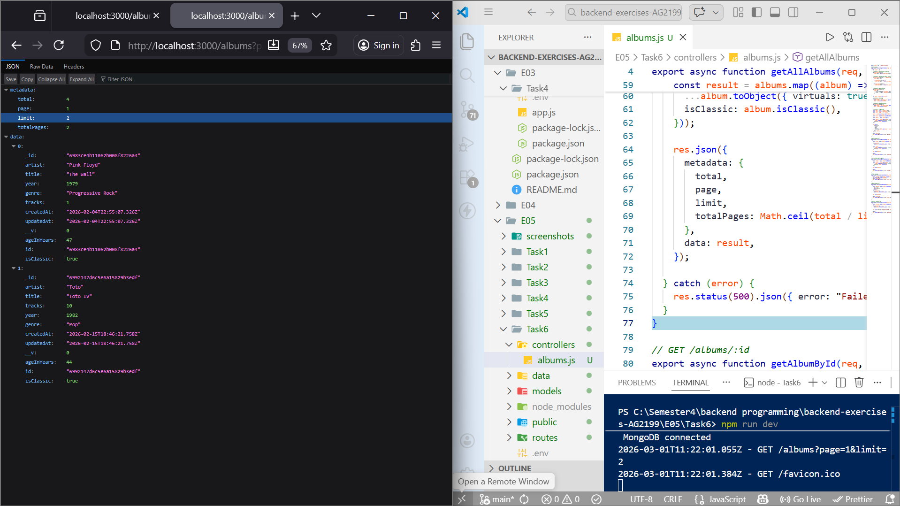

- 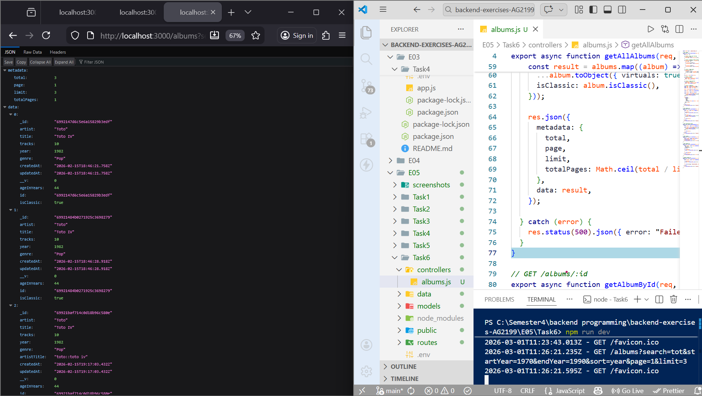


##AI Usage

I used AI assistance approximately 15–20% of the time.

AI helped me:

- Understand query building logic

- Debug filtering problems

- Improve controller structure

However, I personally implemented, tested, and verified all functionality.

##Final Reflection

This exercise helped me understand how real-world APIs handle large datasets.

I learned:

How to dynamically build MongoDB queries

How to combine multiple filters

How sorting and field selection improve usability

How pagination improves performance

How to design flexible and professional API endpoints

Overall, this exercise improved my backend development skills and helped me understand how to build scalable REST APIs.