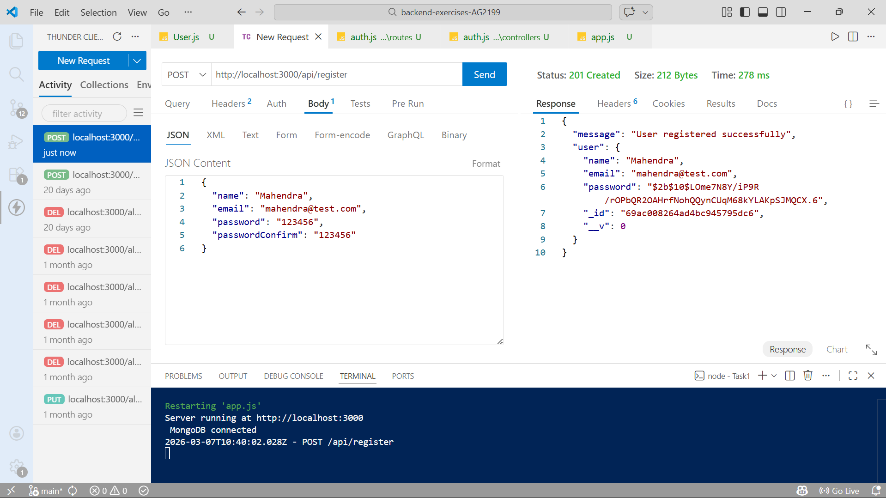
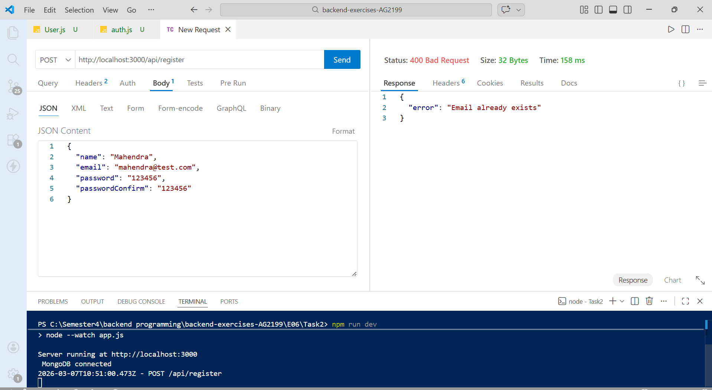
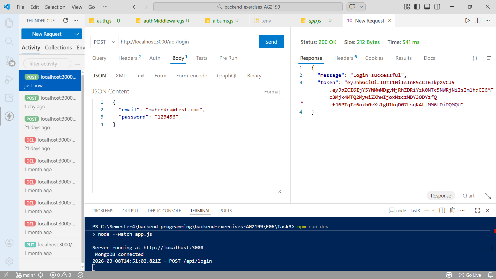
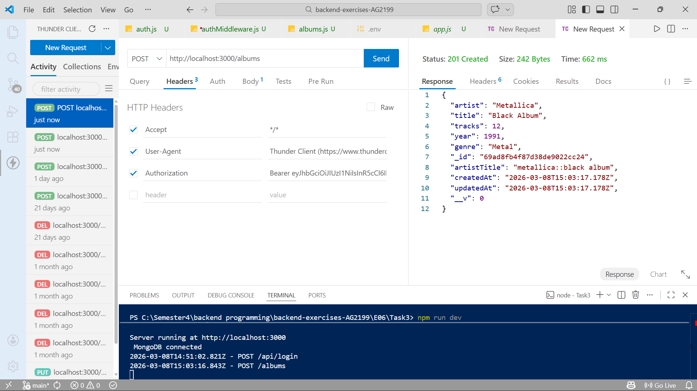
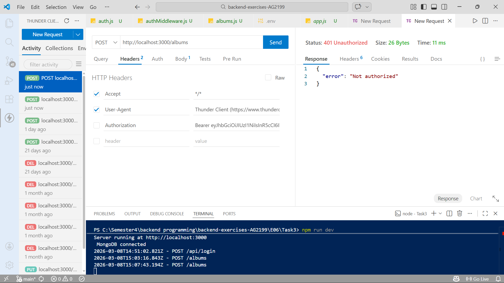
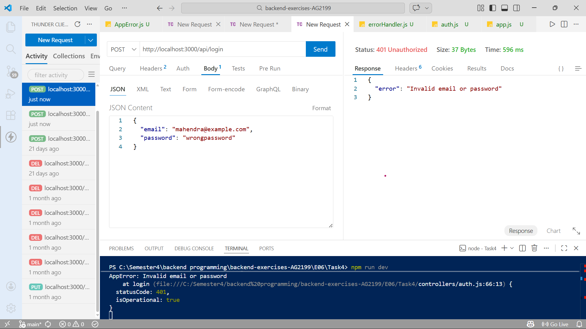
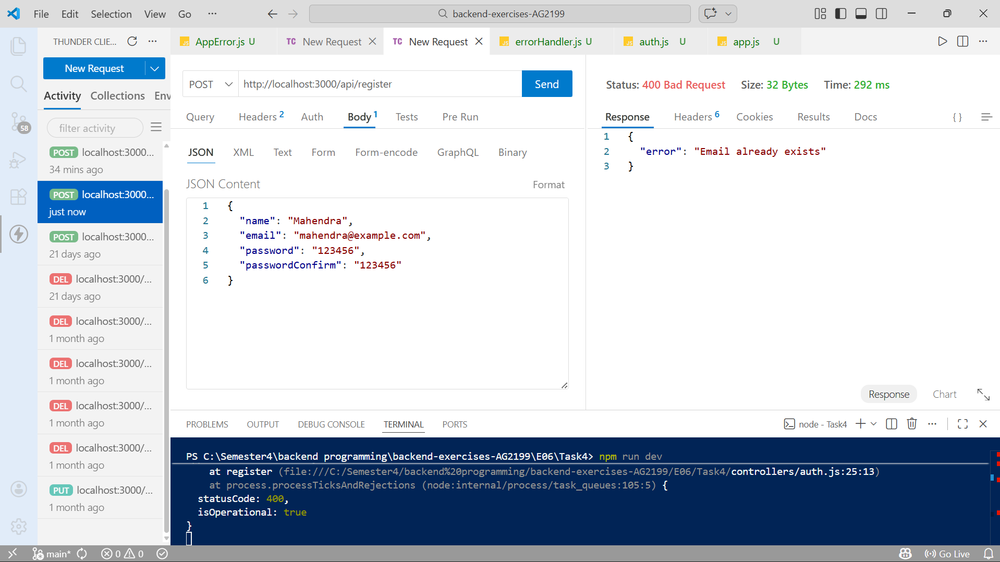

# Exercise set 06

**Mahendra Pahadi**  
Backend Programming – JAMK University of Applied Sciences  
Spring 2026 

----

In this exercise set, I continued developing the Album API that was created in the previous exercises using Node.js, Express, MongoDB, and Mongoose.

The goal of this assignment was to add user authentication and authorization to the API. This improves the security of the backend by ensuring that only registered users can perform sensitive operations such as creating, updating, or deleting albums.

During the tasks I implemented the following features:

User registration with password hashing

Duplicate email validation

JWT-based authentication

Authorization for protected API endpoints

Custom error handling for consistent API responses

All features were tested using Thunder Client to verify that the API behaves correctly and securely.
----

## Task 1

In this task, I implemented a user registration system for the API.

First, I created a User schema in models/User.js. The schema includes the following fields:

- name

- email

- password

The password should not be stored as plain text. Therefore, I used bcryptjs to hash the password before saving it to the database.

To achieve this, I used Mongoose pre middleware:
```js
userSchema.pre("save", async function (next) {
  if (!this.isModified("password")) return next();

  const salt = await bcrypt.genSalt(10);
  this.password = await bcrypt.hash(this.password, salt);

  next();
});
```
The middleware checks whether the password has been modified using this.isModified("password").
This prevents already hashed passwords from being hashed again when the user document is updated.

Next, I created a registration route:

POST /api/register

The controller checks that all required fields are provided:

- name

- email

- password

- passwordConfirm

If the passwords match and the data is valid, the user is saved in the MongoDB database.

Example request:
```json
{
  "name": "Mahendra",
  "email": "mahendra@test.com",
  "password": "123456",
  "passwordConfirm": "123456"
}
```
Example response 
```json
{
  "message": "User registered successfully"
}
```

I tested the registration using Thunder Client, and the API successfully stored the new user in the database with the password hashed.

**Learning result**

In this task, I learned how password hashing improves application security and prevents sensitive user data from being stored in plain text.

**Screenshot**

User registration request and response are shown below.

- 


## Task 2

In this task, I improved the registration process by preventing users from registering with an email address that already exists in the database.

When a new user tries to register, the system must first check whether the email address is already stored in the database. If the email already exists, the registration should fail and return an error message.

To implement this functionality, I added a check inside the registration controller before creating the new user.

Example:
```js

const existingUser = await User.findOne({ email });

if (existingUser) {
  throw new AppError("Email already exists", 400);
}
```

This code searches the database for a user with the same email address. If a matching record is found, the API throws a custom error instead of saving a new user.

If the email does not exist, the registration process continues normally and the user is created.

Example registration request:
```json

{
  "name": "Mahendra",
  "email": "mahendra@test.com",
  "password": "123456",
  "passwordConfirm": "123456"
}
```json

If the same email is used again, the server returns an error response:

{
  "error": "Email already exists"
}
```

This validation ensures that each email address can only be registered once in the system.

**Learning result**

In this task, I learned how to perform database validation before creating new records and how to prevent duplicate data in MongoDB collections.

**Screenshot**

The duplicate email validation error is shown in the screenshot below.

- 


## Task 3 

In this task, I implemented JWT authentication so that users can log in and receive a token.

I created a new route:

POST /api/login

The login process works as follows:

The user provides email and password.

The server checks if the user exists.

The password is compared using bcrypt.

If the credentials are correct, a JWT token is generated.

Example login request:
```JSON
{
  "email": "mahendra@test.com",
  "password": "123456"
}

Example response:

{
  "message": "Login successful",
  "token": "token...."
}
```
After logging in, the client must include the token in the request header:

Authorization: Bearer TOKEN

I then created an authentication middleware to protect certain routes. Only authenticated users can perform the following operations:

- Create albums

- Update albums

- Delete albums

However, the GET /albums route remains public so anyone can view the album list.

**Learning result**

In this task, I learned how JWT tokens allow stateless authentication and how middleware can be used to protect API routes.

**Screenshots**

Login request and token response.

- 

Creating a protected album using a valid JWT token.

- 

without token 

- 


## Task 4 

In this task, I implemented custom error handling to make API responses more consistent and easier to manage.

First, I created a custom error class called AppError.

Example:
```js
class AppError extends Error {
  constructor(message, statusCode) {
    super(message);
    this.statusCode = statusCode;
  }
}
```

export default AppError;

This class allows the application to return errors with both a message and a status code.

Example usage inside a controller:
```js

if (!user) {
  throw new AppError("User not found", 404);
}

```

All errors are then handled in a global error handler, which ensures that the API always returns a consistent error format.

Example error response:
```json

{
  "error": "Invalid email or password"
}
```

This approach makes debugging easier and keeps error responses consistent across the application.

Learning result

This task helped me understand how centralized error handling improves API structure and maintainability.

**Screenshot**

Example error response from the API.

- 


- 

- 


##AI Usage

I used AI assistance approximately 10-15% during this exercise.

AI helped me with:

Understanding JWT authentication

Fixing middleware errors

Debugging bcrypt password hashing

Structuring authentication controllers

However, the implementation, testing, and debugging of the API were done by me.

## Final Reflection

This exercise helped me understand how authentication and security work in backend applications.

During this exercise I learned:

How to securely store user passwords using bcrypt

How to implement user registration and login

How JWT authentication works

How to protect API routes with middleware

How to implement consistent error handling

These concepts are important for building secure and scalable backend systems.