# Exercise set 07

Mahendra Pahadi
Backend Programming – JAMK University of Applied Sciences
Spring 2026

---
In this exercise set, I continued developing the Album API using Node.js, Express, MongoDB, and Mongoose.

The main goal of this exercise was to implement session-based authentication and user roles for authorization. This allows users to log in and maintain a session, and ensures that certain actions can only be performed by authorized users.

All features were tested using Thunder Client to verify that the API behaves correctly and securely.

----

## Task 1

In this task, I replaced JWT authentication with session-based authentication using express-session and Passport.js.

**Key Features Implemented**:

- Users can register and login, with hashed passwords stored in the database.

- After login, a session is created, allowing the user to remain logged in across requests.

- Users can logout, which destroys the session.

- Only authenticated users can perform protected operations:

- Create albums

- Update albums

- Delete albums

Public routes such as GET /albums are still accessible without login.

Example — Register

POST /api/register
```json
{
  "name": "Mahendra",
  "email": "mahendra@example.com",
  "password": "123456",
  "passwordConfirm": "123456"
}
Response:
{
  "message": "User registered successfully",
  "user": {
    "id": "69ad95d2f24f4b5f6fac66bb",
    "name": "Mahendra",
    "email": "mahendra@example.com"
  }
}
```
**Login as a User**

Endpoint: POST /api/login
Description: The user provides email and password to log in. On successful login, a session is created and maintained for future requests.

**Request Example**:
```json
{
  "email": "mahendra@example.com",
  "password": "123456"
}

Response Example:

{
  "message": "Login successful",
  "user": {
    "id": "69ad95d2f24f4b5f6fac66bb",
    "name": "Mahendra",
    "email": "mahendra@example.com",
    "role": "user"
  }
}
```

Screenshot:

- 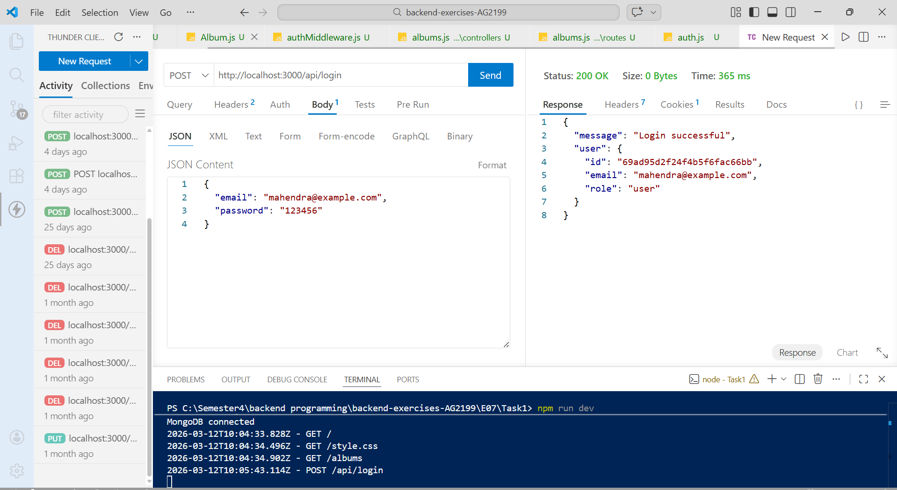


**Create a New Album**

Endpoint: POST /albums
Description: While logged in, the user can create a new album. The owner field is automatically set to the currently logged-in user.

Request Example:
```json
{
  "artist": "Daft Punk",
  "title": "Discovery",
  "year": 2001,
  "genre": "Electronic",
  "tracks": 14
}

Response Example:

{
  "_id": "69b29071b32caf44d1825dd1",
  "artist": "Daft Punk",
  "title": "Discovery",
  "tracks": 14,
  "year": 2001,
  "genre": "Electronic",
  "owner": "69ad95d2f24f4b5f6fac66bb",
  "artistTitle": "daft punk::discovery",
  "createdAt": "2026-03-12T10:07:45.426Z",
  "updatedAt": "2026-03-12T10:07:45.426Z",
  "__v": 0
}
```
Screenshot:

- 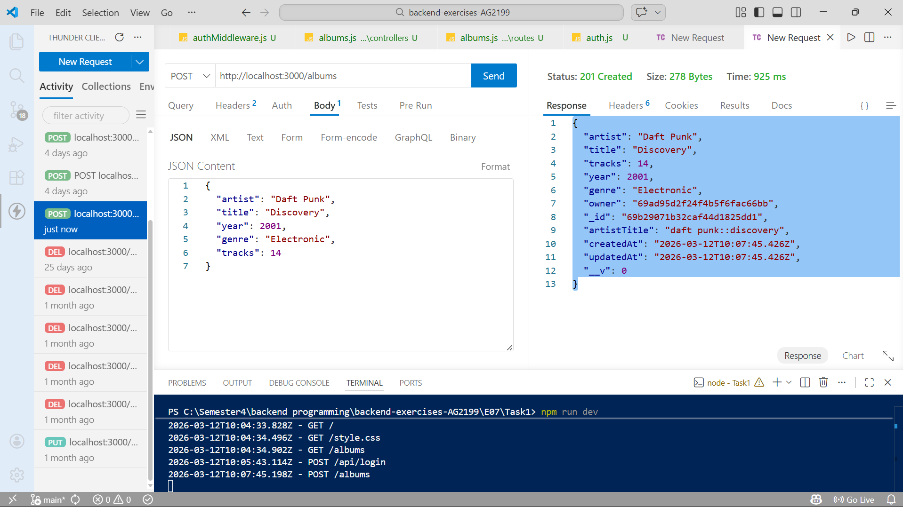

**Logout**

Endpoint: POST /api/logout
Description: Logging out destroys the user’s session. After logout, the user cannot access any protected routes until they log in again.

Response Example:
```json
{
  "message": "Logout"
}
```
Screenshot:

- 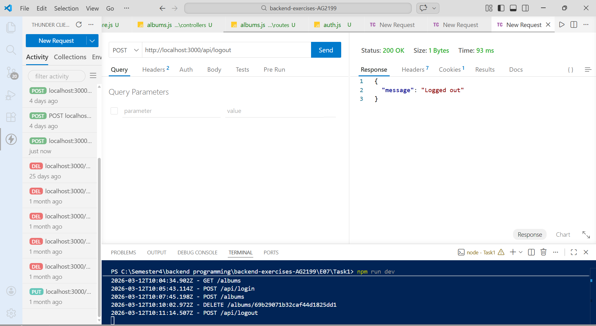


**Access Protected Route After Logout**

Endpoint: POST /albums
Description: After logging out, attempting to create an album or perform other protected actions returns an error.

Response Example:
```json
{
  "error": "Not authenticated"
}
```
Screenshot:'

- 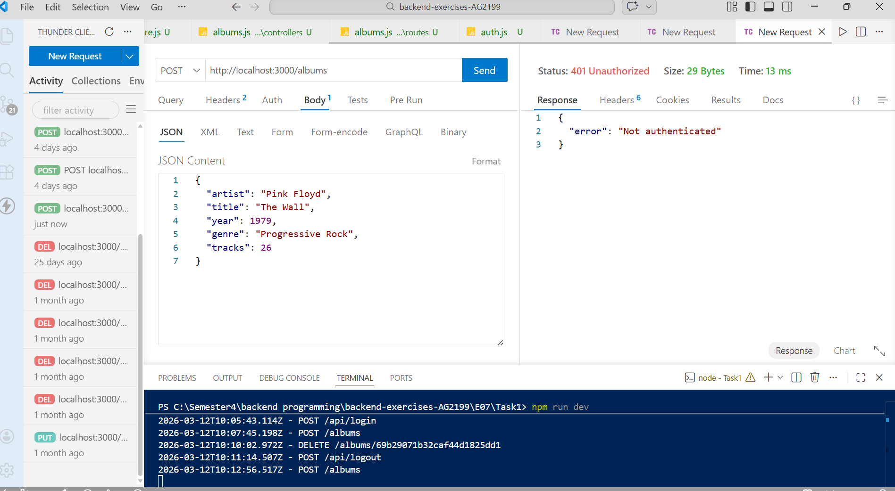

- 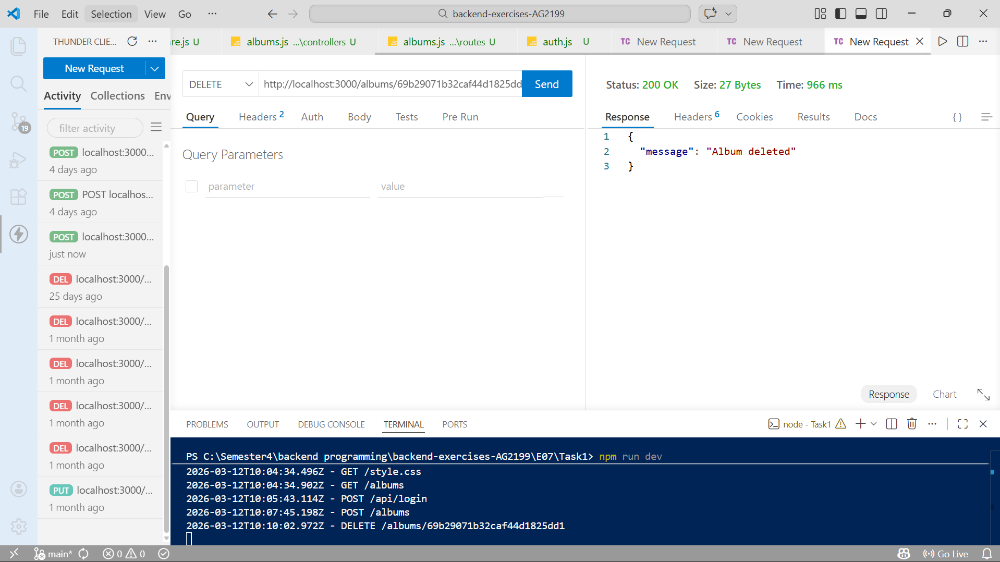


**Learning Outcome**

Through this task, I learned how to implement session-based authentication, enforce access control based on ownership, and manage protected routes. I also verified the functionality using Thunder Client to ensure correct behavior of login, album creation, deletion, and logout.


## Task 2

In this task, I implemented user roles in the Album API to control access based on the type of user. There are two roles:

Admin – can perform all operations on albums and users. Admin can create, update, or delete any album and also manage user accounts.

Regular User – can create new albums, read all albums, and update or delete only the albums they own.

This ensures that sensitive actions are restricted, and users cannot modify resources they do not own.

## Admin Actions

**Create Album**
The admin can create new albums. The system automatically assigns the admin as the owner of the album. After creation, the album is visible to all users.

**Update Album**
The admin can update any album, regardless of who owns it. This allows the admin to correct album information or modify details such as the number of tracks.

**Delete Album**
The admin can delete any album from the collection. This ensures that inappropriate or duplicate albums can be removed efficiently.

**Manage Users**
The admin can view all registered users and delete any user account if needed. This is useful for maintaining the integrity and security of the system.

## Regular User Actions

*Create Album*
Regular users can create albums. The system assigns the user as the owner of the album.

*Update Album*
Users can update only the albums they own. The system checks ownership to prevent unauthorized changes.

*Delete Album*
Users can delete only their own albums. Attempting to delete someone else’s album results in an access denied response.

*Read Albums*
Regular users can view all albums in the collection, including those owned by other users.

**Logout Behavior**

When any user logs out, the session is destroyed, and all protected routes return a "Not authenticated" response. Public routes, such as viewing the album list, remain accessible.

**Learning Outcomes**

From this task, I learned how to:

- Implement role-based access control in a backend application.

- Enforce ownership checks to protect user resources.

- Manage sessions to restrict access to protected routes.

- Design APIs that maintain security while allowing flexibility for admins and regular users.

Screenshots

- 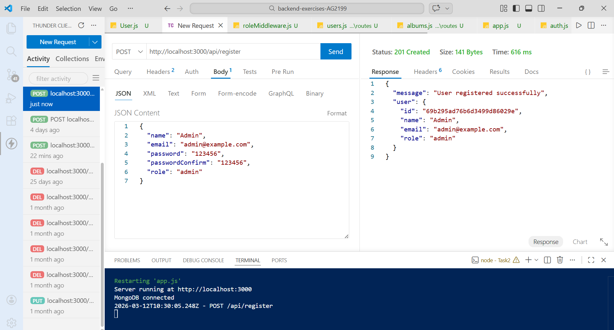

- 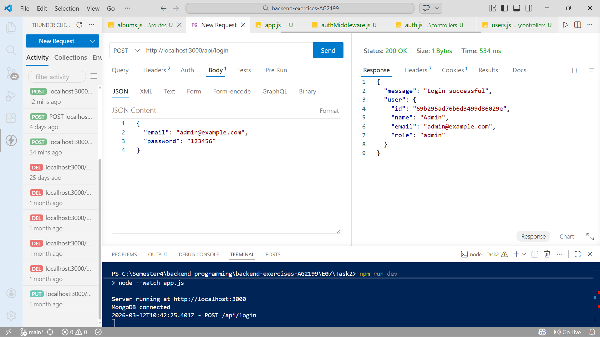

- 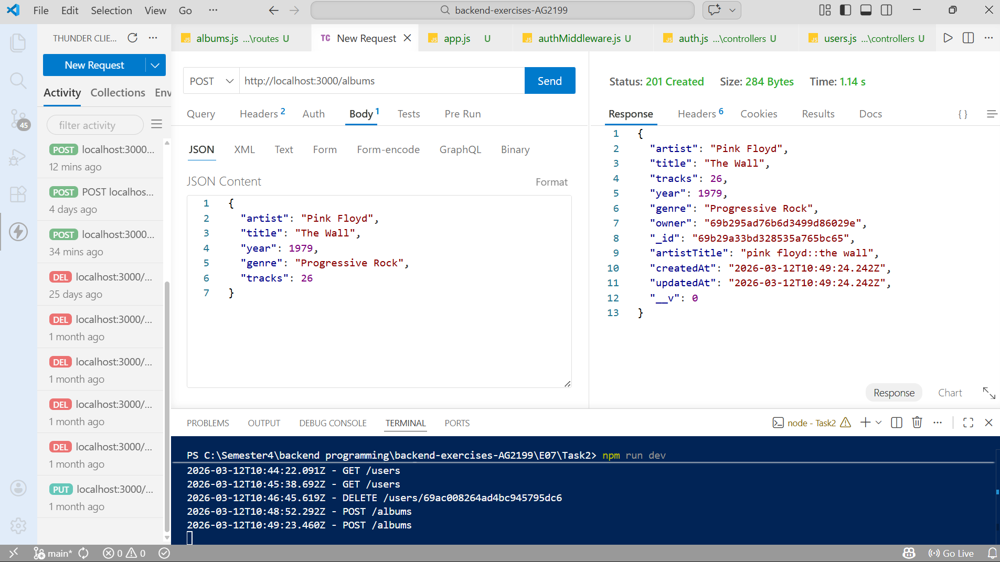

- 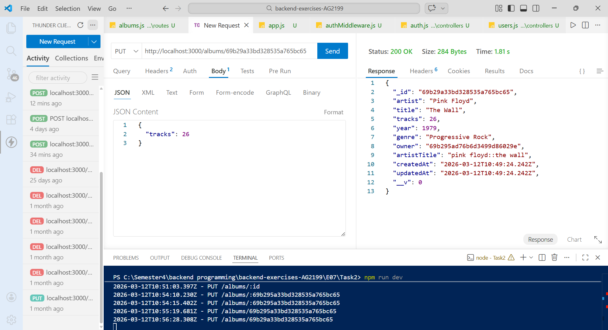

- 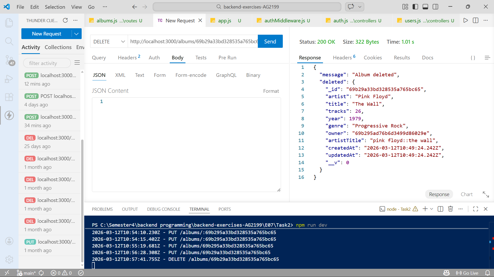

- 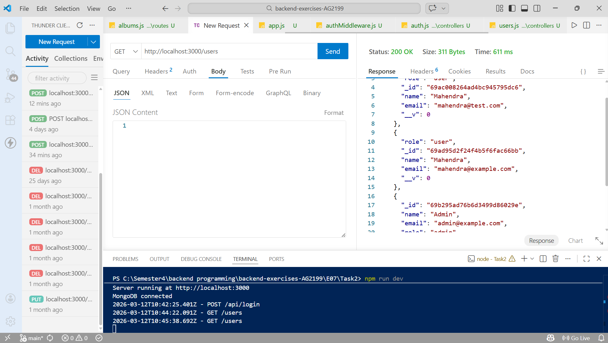

- 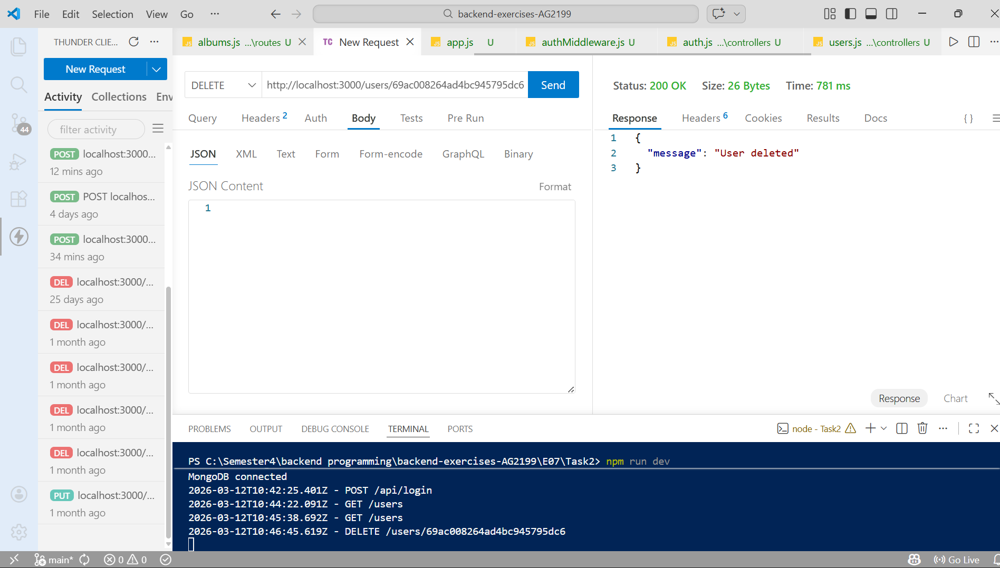

- 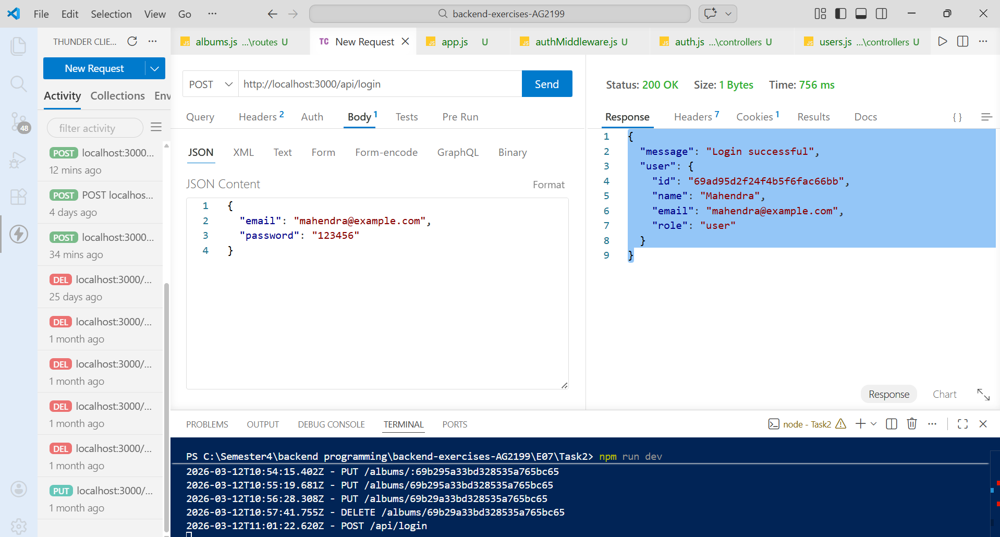

- 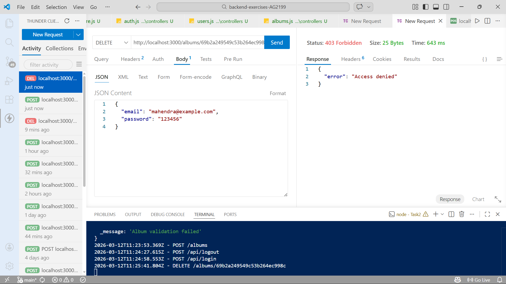

- 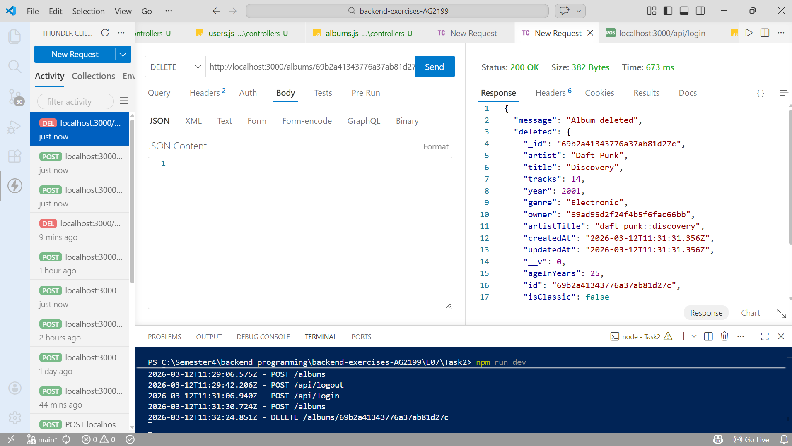


## AI Usage

During this exercise, I used AI assistance for approximately 10–15% of the work. AI helped me with:

- Understanding session-based authentication and role-based authorization.

- Debugging middleware errors and Passport.js integration.

- Structuring controllers for albums and users.

- Writing ownership checks for secure API operations.


All implementation, testing, and debugging were done by me. AI was only used as guidance and for improving code clarity.


## Final Reflection

This exercise helped me understand how authentication, authorization, and session management work in backend applications.

Key lessons learned:

- How to implement session-based login and logout using Passport.js and express-session.

- How to protect API routes so that only authenticated users can perform sensitive actions.

- How to create user roles (admin and regular user) and enforce role-specific permissions.

- How to enforce ownership checks to prevent unauthorized modifications.

- How to ensure secure logout, so protected routes cannot be accessed after logout.

- How to provide consistent error handling for a professional API.

Overall, I learned how to build a backend application that is both secure and flexible, supporting multiple user roles and enforcing access control correctly. This is essential for real-world web applications.