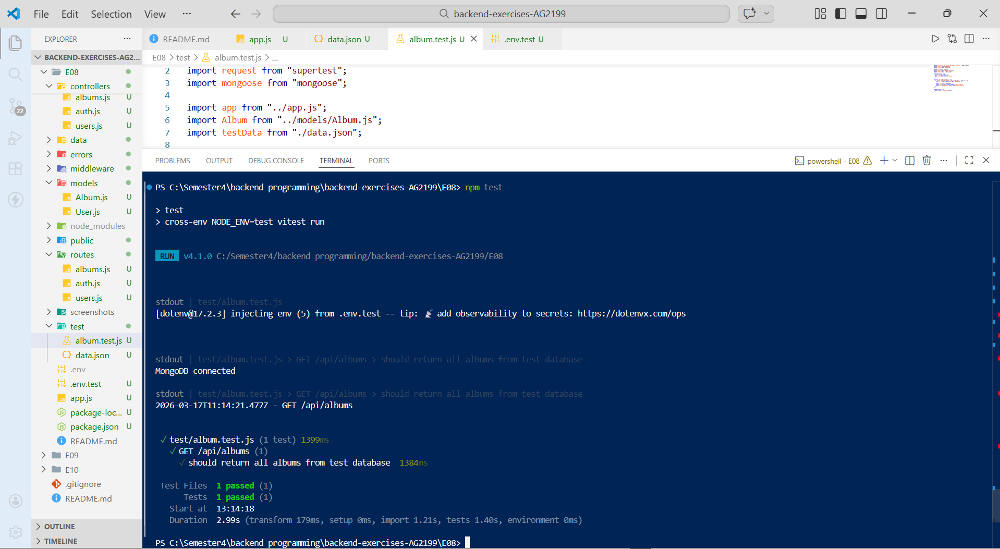
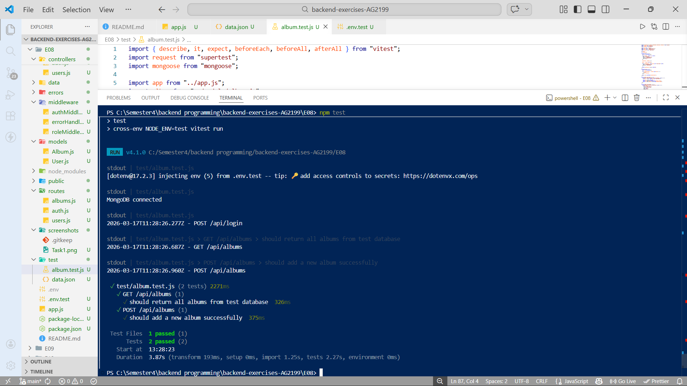
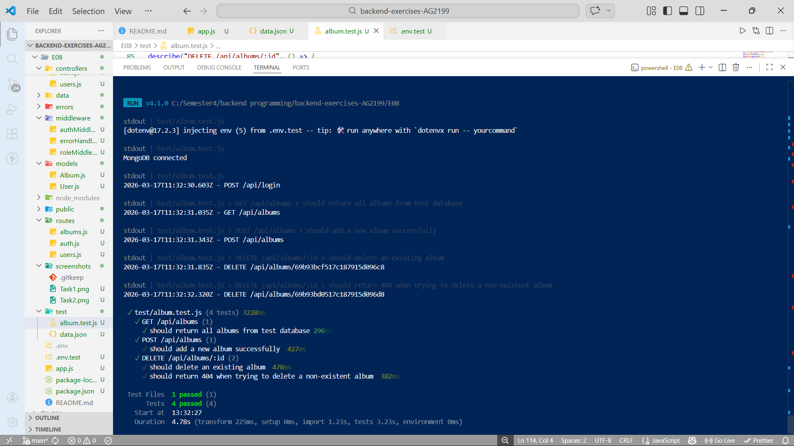
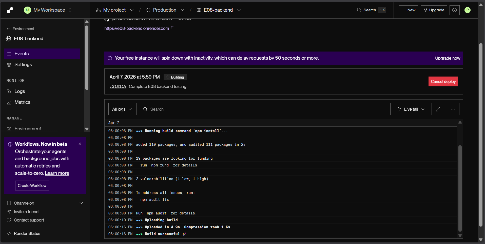
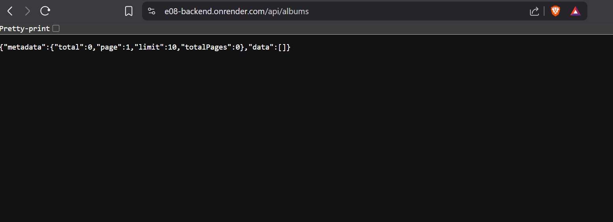

# Exercise set 08

Mahendra Pahadi  
Backend Programming – JAMK University of Applied Sciences  
Spring 2026  

---

In this exercise set, I focused on backend testing and deployment of the Album API built using Node.js, Express, MongoDB, and Mongoose.

The main goal of this exercise was to implement automated testing for API endpoints and deploy the application to a cloud platform.

Testing was performed using Vitest and Supertest, and the application was deployed using Render.

---

## Task 1 – Test database setup and GET endpoint testing

In this task, I created a separate test environment for the application.

**Key Features Implemented:**

- Installed testing tools: Vitest and Supertest  
- Created a separate test database using `.env.test`  
- Used `beforeEach()` to reset and seed the database before each test  
- Created a `data.json` file with test album data  
- Tested the GET `/api/albums` endpoint  

The test verifies that the number of albums returned matches the number of albums in the test database.

**Example Test Result:**
```text
GET /api/albums
should return all albums from test database
```
**Screenshot:**
- 


**Learning Outcome**

I learned how to set up a test database, seed data before tests, and verify API responses using automated testing tools.

## Task 2 – POST endpoint testing

In this task, I wrote tests for the POST /api/albums endpoint.

Since the route is protected, I used session-based authentication with Passport.js and Supertest’s agent to maintain login sessions during testing.

**Key Features Implemented:**

Created a test user
Logged in using /api/login
Maintained session using request.agent()
Sent authenticated POST request
Verified that:
Response status is 201
Album data is correct
Album count increases by one

**Example Test Result:**

 POST /api/albums
 should add a new album successfully

**Screenshot:**
- 

**Learning Outcome**

I learned how to test protected routes, simulate authentication, and verify database changes after API requests.

## Task 3 – DELETE endpoint testing

In this task, I tested the DELETE /api/albums/:id endpoint.

**Key Features Implemented:**

Tested deleting an existing album
Verified that:
Album count decreases
Deleted album is no longer present
Tested deleting a non-existent album
Verified proper error handling (404 response)

**Example Test Result:**

 DELETE /api/albums/:id
 should delete an existing album
 should return 404 when trying to delete a non-existent album

**Screenshot:**
- 

**Learning Outcome**

I learned how to test different scenarios including success cases and error handling, ensuring API reliability.

## Task 4 – Application deployment

In this task, I deployed the application to the cloud using Render.

**Deployment Steps:**

Pushed project to GitHub
Connected repository to Render
Set root directory to E08
Configured:
Build command: npm install
Start command: npm start
Added environment variables:
MONGO_URI
SESSION_SECRET
JWT_SECRET
JWT_EXPIRES_IN
NODE_ENV

After deployment, I verified the API by accessing the live endpoint.

Live URL:

https://e08-backend.onrender.com/api/albums

**Result:**

The API successfully returned a valid JSON response from the production database.

**Screenshots:**
- 
- 
- 
- 


**Learning Outcome**

I learned how to deploy a backend application, configure environment variables, and test a live API in a production environment.

**AI Usage**

During this exercise, I used AI assistance for approximately 20-25% of the work. AI helped me with:

Understanding backend testing with Vitest and Supertest
Debugging authentication and testing issues
Fixing deployment errors on Render
Structuring test cases and improving code clarity

All implementation, testing, and deployment were done by me. AI was used only for guidance.

**Final Reflection**

This exercise helped me understand how to test and deploy backend applications in a real-world environment.

**Key lessons learned:**

How to write unit and integration tests for APIs
How to use a separate test database for safe testing
How to test protected routes with authentication
How to handle error scenarios in API testing
How to deploy an application to the cloud
How to configure environment variables for production

Overall, I gained practical experience in building, testing, and deploying a complete backend system, which is essential for modern web development.