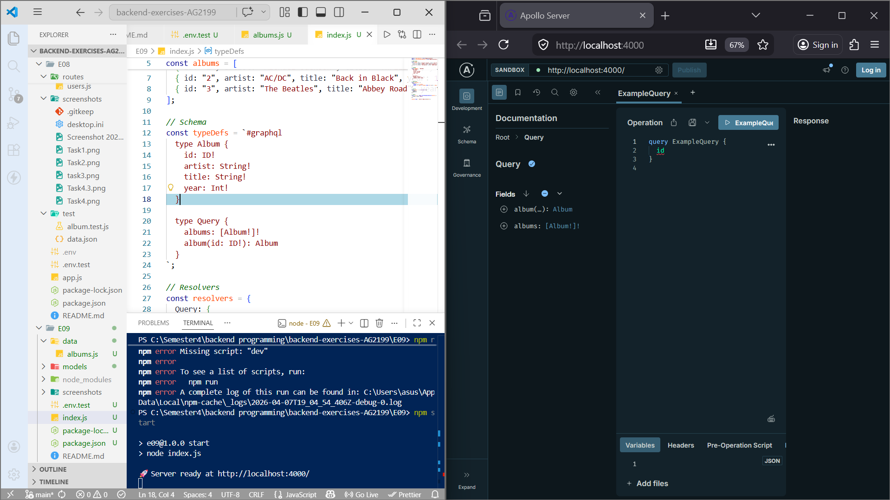
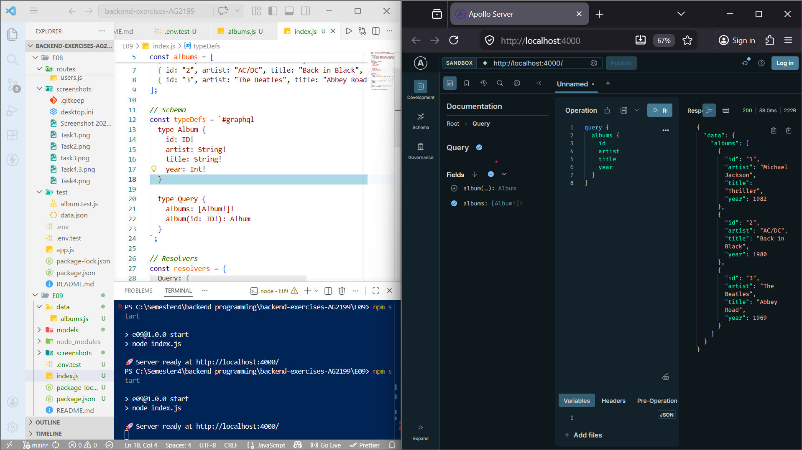
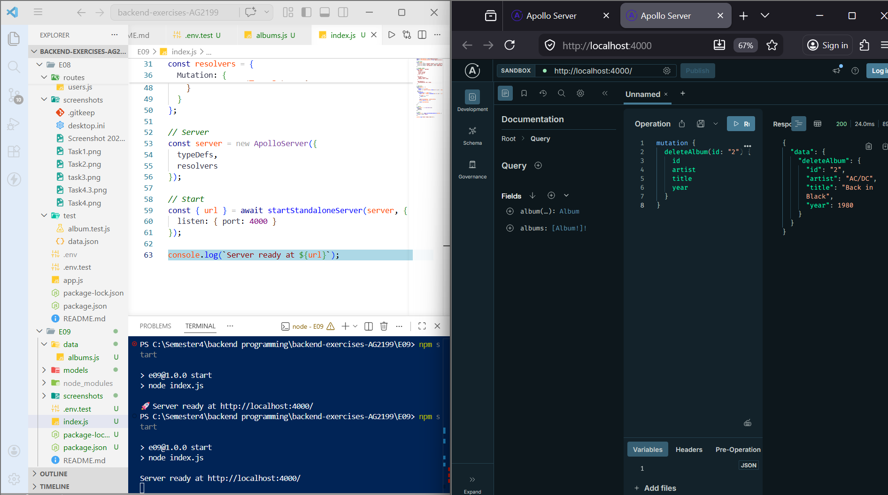
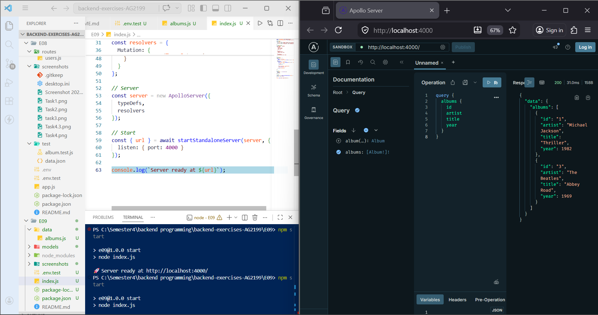
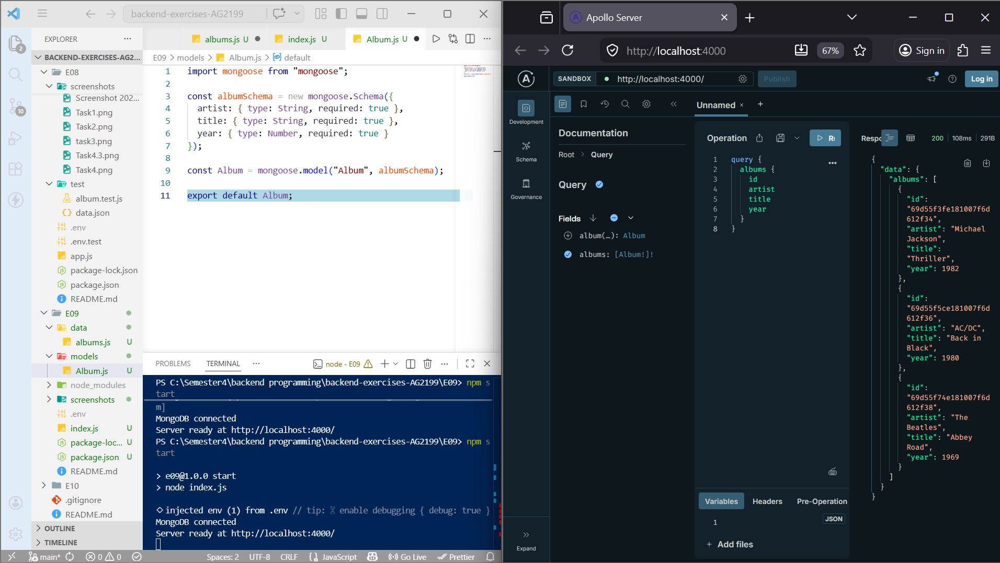
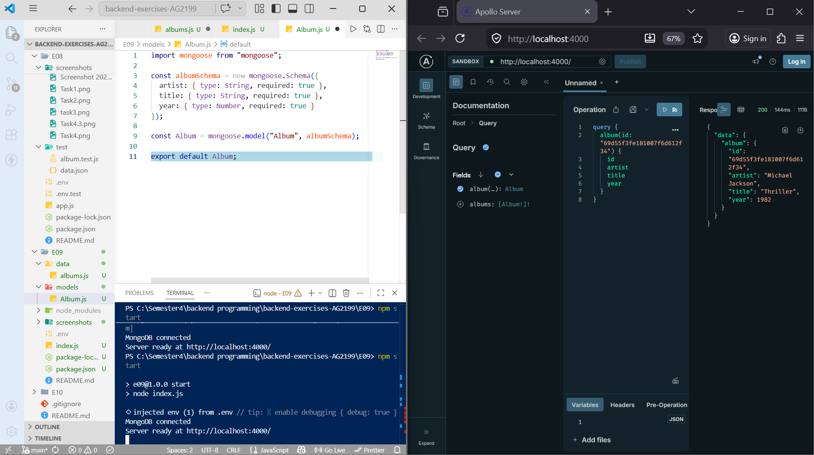
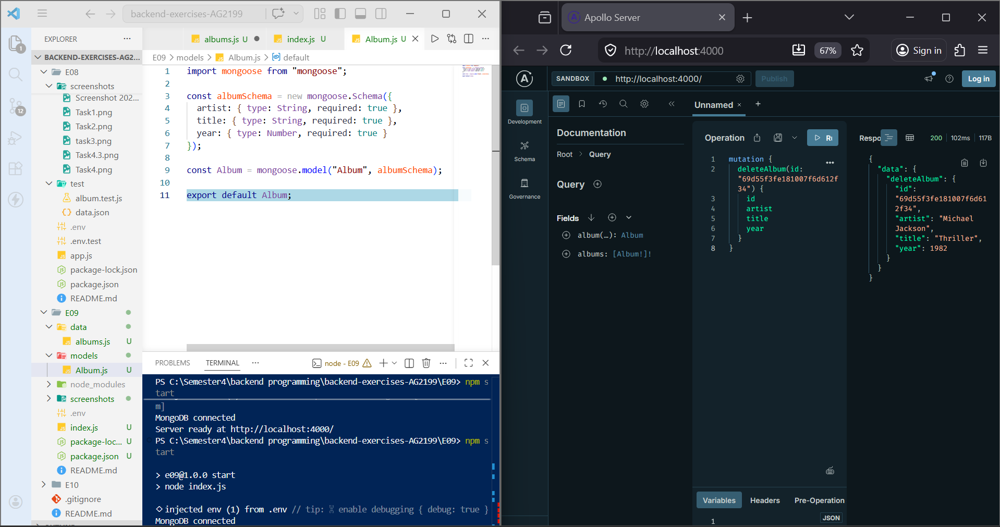
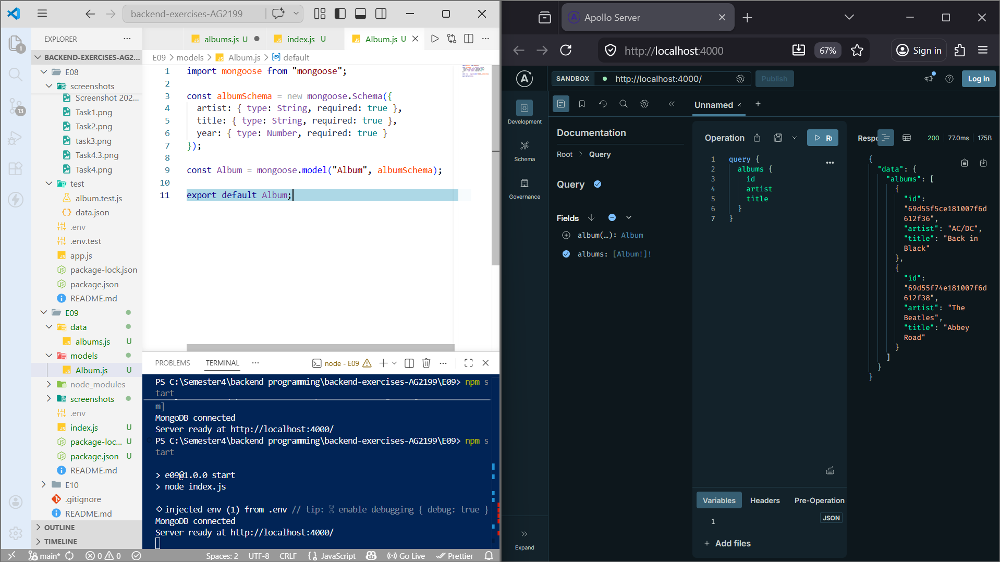

Exercise Set 09

Mahendra Pahadi
Backend Programming – JAMK University of Applied Sciences
Spring 2026

In this exercise, I learned how to build a GraphQL server using Apollo Server. I also learned how to create queries and mutations, and how to connect GraphQL with MongoDB.

All tasks were tested using Apollo Sandbox.

## Task 1 – GraphQL server setup and schema definition

In this task, I created a GraphQL server using Apollo Server. I defined a schema for album data and used a simple array as mock data.

What I did:

Created a GraphQL server
Defined an Album type with fields:
id
artist
title
year
Created queries:
albums → get all albums
album(id) → get one album
Used a static array to store album data

This task helped me understand how GraphQL works and how schemas and resolvers are connected.

**Screenshot:**
- 

## Task 2 – Query implementation and testing

In this task, I tested queries in Apollo Sandbox.

Queries used:

Get all albums:

query {
  albums {
    id
    artist
    title
    year
  }
}

Get one album by id:

query {
  album(id: "1") {
    id
    artist
    title
    year
  }
}

Results:

I was able to get all albums
I was able to get one album by id

This task helped me understand how to request data in GraphQL.

**Screenshot:**
- 

- 

## Task 3 – Mutation implementation

In this task, I added a mutation to delete an album.

Mutation:

mutation {
  deleteAlbum(id: "2") {
    id
    artist
    title
    year
  }
}

What I did:

Created mutationdeleteAlbum
Removed album from the array
Returned deleted album
Checked result by running query again

**Results:**

Album was deleted successfully
The list updated correctly

This task helped me understand how GraphQL can change data.

**Screenshot:**
- 

- 

## Task 4 – Database integration

In this task, I connected GraphQL with MongoDB.

What I did:

Created a Mongoose model for albums
Connected to MongoDB using .env
Replaced mock data with database
Updated resolvers to use MongoDB

Functions used:

Album.find()
Album.findById()
Album.findByIdAndDelete()

**Results:**

Data was loaded from MongoDB
Query worked correctly
Delete mutation worked correctly

This task helped me understand how to use GraphQL with a real database.

**Screenshot:**
- 

- 

- 

- 

**AI Usage**

I used AI for about 10–15% of this exercise.

AI helped me with:

Understanding GraphQL
Fixing errors
Writing schema and resolvers

All coding, testing, and debugging were done by me. AI was used only as support.

**Final Reflection**

This exercise helped me learn GraphQL and how it is different from REST APIs.

**What I learned:**

How to create a GraphQL server
How to define schema and types
How to write queries and mutations
How to test using Apollo Sandbox
How to connect GraphQL with MongoDB

GraphQL is useful because it allows users to request only the data they need. This makes applications faster and more flexible.