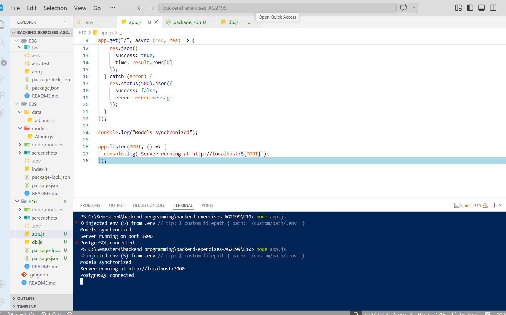
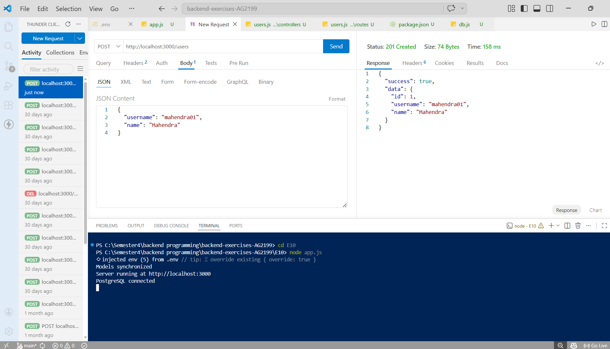
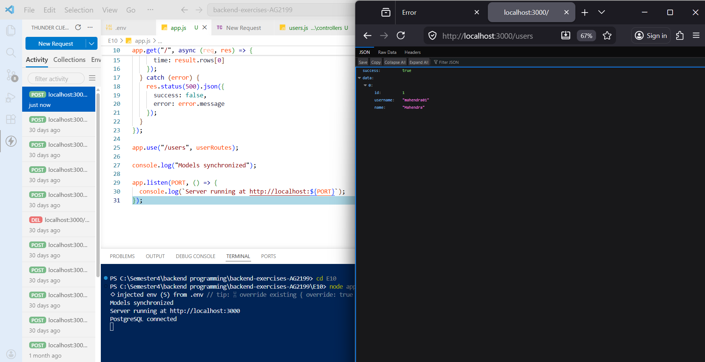
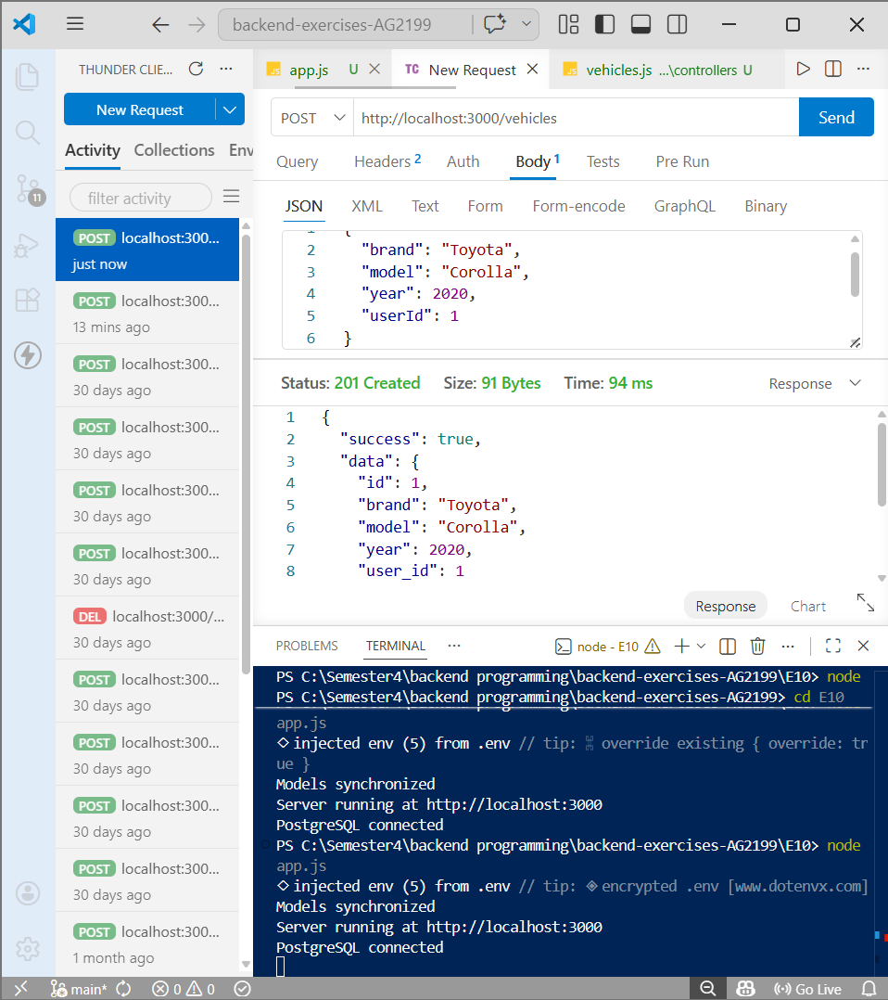
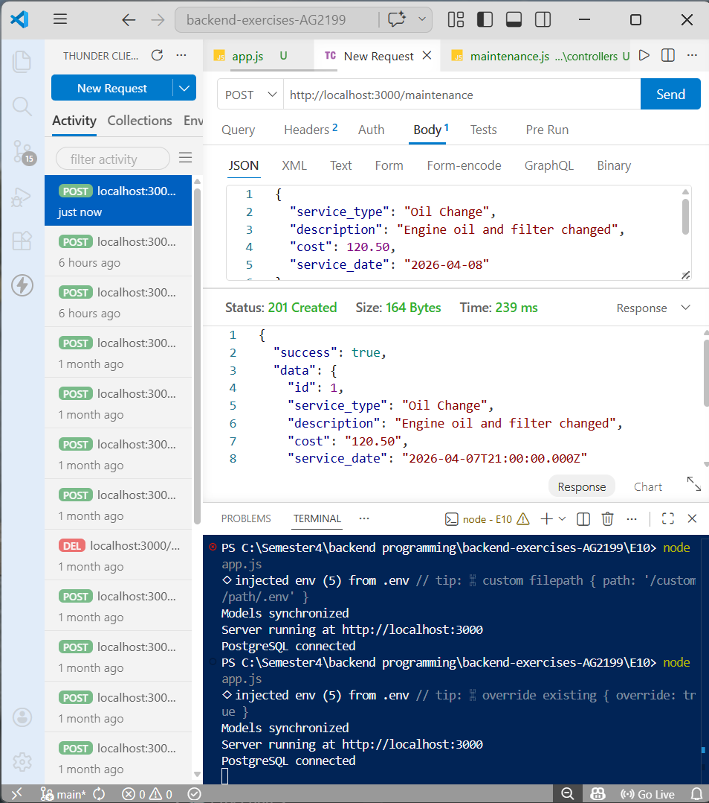
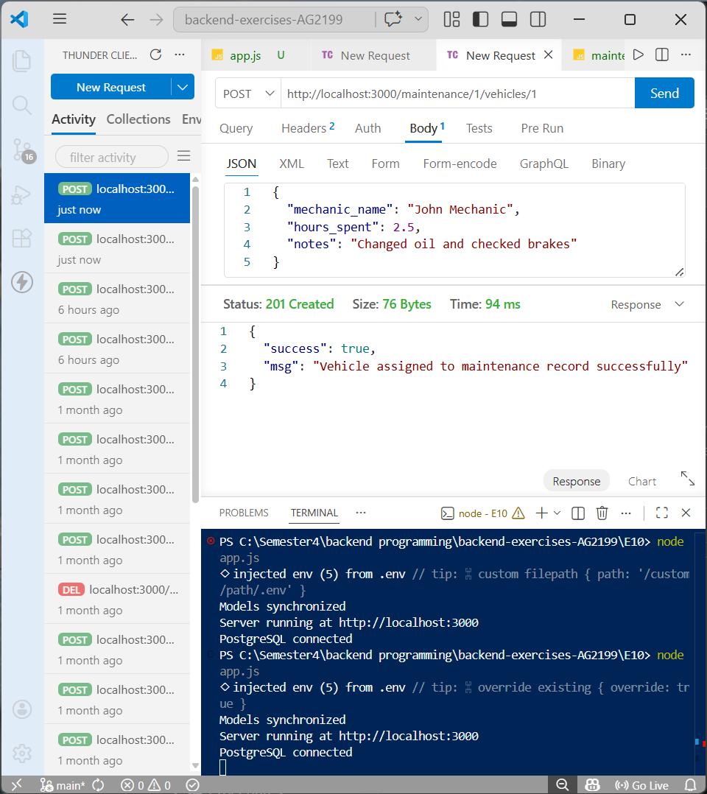
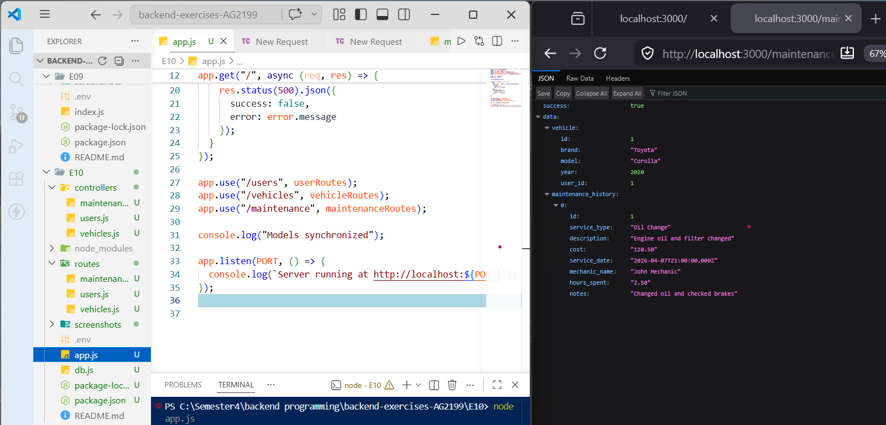

# Exercise set 10

Mahendra Pahadi
Backend Programming – JAMK University of Applied Sciences
Spring 2026

---
In this exercise set, I worked with PostgreSQL and relational databases. The main goal was to understand how database relationships work, including one-to-many and many-to-many relationships.

I used Node.js, Express, and PostgreSQL to build a backend application that manages users, vehicles, and maintenance records.

All API endpoints were tested using Thunder Client.
---

## Task 1

In this task, I created the base application using PostgreSQL. I configured the database connection and ensured that the server connects successfully.

The server was started using:
node app.js 

After starting the server, I verified that PostgreSQL was connected and the application was running on:

http://localhost:3000

#Screenshot
- 

## Task 2 – User model implementation

In this task, I created a **user model** using PostgreSQL. The users table includes the following fields:

- id (primary key)
- username
- name

I also implemented API routes to allow creating new users and retrieving all users from the database.

### Create User

**Endpoint:**  
POST `/users`

**Description:**  
This endpoint allows creating a new user by sending username and name in the request body.

**Request Example:**
```json
{
  "username": "mahendra01",
  "name": "Mahendra"
}
```
Response Example:
```json
{
  "success": true,
  "data": {
    "id": 1,
    "username": "mahendra01",
    "name": "Mahendra"
  }
}
```

**Get All Users**

Endpoint:
GET /users

**Description:**
This endpoint returns a list of all users stored in the database.

Response Example:
```json
{
  "success": true,
  "data": [
    {
      "id": 1,
      "username": "mahendra01",
      "name": "Mahendra"
    }
  ]
}
```
**Screenshot**
- 

- 

**Learning Outcome:**

Through this task, I learned how to:

- Create a table in PostgreSQL
- Insert data into the database using SQL queries
- Build REST API routes with Express
- Connect backend routes with PostgreSQL using the pg library
- Test API endpoints using Thunder Client

## Task 3 – Database relationships (One-to-Many)

In this task, I implemented a **one-to-many relationship** between users and vehicles using PostgreSQL.

This means:
- One user can own many vehicles  
- Each vehicle belongs to only one user  

To achieve this, I created a `vehicles` table and added a `user_id` field as a **foreign key** that references the `users` table.

---

### Create Vehicle

**Endpoint:**  
POST `/vehicles`

**Description:**  
This endpoint allows creating a new vehicle and assigning it to a user using `userId`.

**Request Example:**
```json
{
  "brand": "Toyota",
  "model": "Corolla",
  "year": 2020,
  "userId": 1
}
```
**Response Example:**
```json
{
  "success": true,
  "data": {
    "id": 1,
    "brand": "Toyota",
    "model": "Corolla",
    "year": 2020,
    "user_id": 1
  }
}
```
**Get All Vehicles**

Endpoint:
GET /vehicles

Description:
This endpoint returns all vehicles along with their owner information using a SQL JOIN between vehicles and users.

**Response Example:**
```json 
{
  "success": true,
  "data": [
    {
      "id": 1,
      "brand": "Toyota",
      "model": "Corolla",
      "year": 2020,
      "user_id": 1,
      "username": "mahendra01",
      "name": "Mahendra"
    }
  ]
}
```
**Screenshot**
- 

- 


**Learning Outcome**

Through this task, I learned how to:

- Create relationships between tables using foreign keys
- Implement one-to-many relationships in PostgreSQL
- Use SQL JOIN queries to combine data from multiple tables
- Design APIs that connect related data correctly
- Ensure data consistency between users and vehicles

This task helped me understand how real-world applications store and manage related data in relational databases.

## Task 4 – Many-to-Many relationships

In this task, I implemented a **many-to-many relationship** between vehicles and maintenance records using PostgreSQL.

This means:
- One vehicle can have many maintenance records  
- One maintenance record can be linked to many vehicles  

To achieve this, I created two tables:
- `maintenance_records` – stores maintenance details  
- `vehicle_maintenance_records` – a junction table that connects vehicles and maintenance records  

The junction table also includes additional fields such as:
- mechanic_name  
- hours_spent  
- notes  

These fields store extra information about each maintenance operation.

---

### Create Maintenance Record

**Endpoint:**  
POST `/maintenance`

**Description:**  
This endpoint creates a new maintenance record in the database.

**Request Example:**
```json
{
  "service_type": "Oil Change",
  "description": "Engine oil and filter changed",
  "cost": 120.50,
  "service_date": "2026-04-08"
}
```
**Response Example:**
```json
{
  "success": true,
  "data": {
    "id": 1,
    "service_type": "Oil Change",
    "description": "Engine oil and filter changed",
    "cost": "120.50",
    "service_date": "2026-04-08T00:00:00.000Z"
  }
}
```
**Assign Vehicle to Maintenance**

Endpoint:
POST /maintenance/:maintenanceId/vehicles/:vehicleId

**Description:**
This endpoint links a vehicle with a maintenance record and stores additional details such as mechanic name and hours spent.

**Request Example:**
```json
{
  "mechanic_name": "John Mechanic",
  "hours_spent": 2.5,
  "notes": "Changed oil and checked brakes"
}
``` 
**Response Example:**
```json 
{
  "success": true,
  "msg": "Vehicle assigned to maintenance record successfully"
}
```
**Get Vehicle Maintenance History**

Endpoint:
GET /maintenance/vehicles/:vehicleId/history

Description:
This endpoint returns a vehicle along with its maintenance history, including data from the junction table.

**Response Example:**
```json
{
  "success": true,
  "data": {
    "vehicle": {
      "id": 1,
      "brand": "Toyota",
      "model": "Corolla",
      "year": 2020,
      "user_id": 1
    },
    "maintenance_history": [
      {
        "id": 1,
        "service_type": "Oil Change",
        "description": "Engine oil and filter changed",
        "cost": "120.50",
        "service_date": "2026-04-08T00:00:00.000Z",
        "mechanic_name": "John Mechanic",
        "hours_spent": "2.50",
        "notes": "Changed oil and checked brakes"
      }
    ]
  }
}
```
**Screenshot**
- 

- 

- 

# AI Usage

During this exercise, I used AI assistance for approximately 10–15% of the work.

**AI helped me with:**

Understanding PostgreSQL relationships
Designing SQL queries and joins
Debugging API routes and errors
Structuring controllers and routes

All coding, testing, and implementation were done by me.

# Final Reflection

This exercise helped me understand how relational databases work in backend development.

**Key things I learned:**

How to connect Node.js with PostgreSQL
How to create tables and define relationships
How to implement one-to-many relationships using foreign keys
How to build many-to-many relationships using a junction table
How to write SQL JOIN queries to fetch related data
How to design APIs that interact with relational databases

Overall, I now understand how real-world applications manage structured data and relationships between different entities.